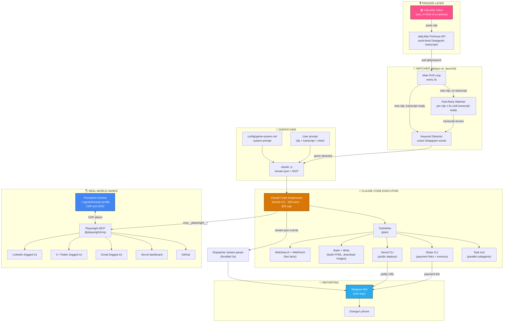
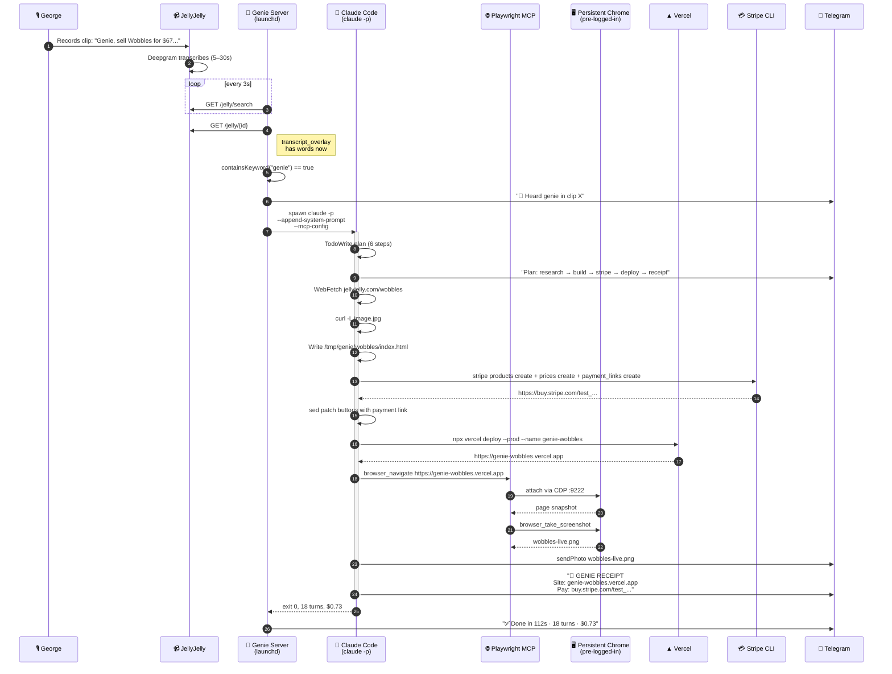

<div align="center">

# 🧞 Genie 2.0

> **Forked from genie v1 — production evolution**

### *You wished for it.*

**A voice-triggered autonomous agent powered by Claude Code. Speak a wish into a JellyJelly video, Genie hears "genie," and an ephemeral Claude Code instance wakes up with full browser, shell, and payment rails to make it real.**

[](https://www.betaworks.com/event/mischiefclaw-hack-ny)
[](https://www.anthropic.com/claude-code)
[](https://jellyjelly.com)
[](./LICENSE)

</div>

---

## The pitch in one breath

You talk at a camera. You say *"Genie, build me a site for X and post about it on my Twitter."* A few seconds later your phone buzzes with a live URL, a screenshot, and the tweet link. You never touched a keyboard.

**You cannot message Genie. You can only wish.** The relationship is one-way by design — camera in, Telegram out. Every wish spawns a fresh Claude Code subprocess with a 200-turn budget, full Playwright access to your already-logged-in browser, a Stripe CLI for invoices, a Vercel CLI for deploys, and a WebSearch+WebFetch research loop. When it's done, it reports to Telegram with receipts and vanishes.

---

## 🏗️ Architecture



---

## 🎬 Full wish lifecycle (sequence)



---

## 🔥 Real wishes, real receipts

Every one of these was a single JellyJelly clip, end-to-end:

| Wish (spoken into a camera) | What Genie actually did |
|---|---|
| *"Genie, post on my X that I'm obsessed with G wagons"* | Drove `x.com/compose/tweet` in my logged-in Chrome, composed the tweet in my voice, posted it, sent URL to Telegram |
| *"Genie, research the NY Auto Show at Javits Center and build me a site"* | Perplexity Sonar research → real 2026 dates, prices, brands → HTML with real imagery → Vercel deploy → public URL to Telegram |
| *"Genie, sell Wobbles for $67, make me a Stripe checkout"* | Downloaded plushie photos from jellyjelly.com → built a dark landing page → Stripe CLI created a payment link → patched buttons → Vercel deploy → screenshot + link to Telegram |
| *"Genie, book me a Cybertruck test drive at Meatpacking Tesla"* | Opened tesla.com/drive in my logged-in Chrome → filled the form → submitted → confirmation page screenshot to Telegram |

---

## 🧩 Why Claude Code as the execution engine

The first version of Genie was a traditional agent: custom `interpreter.mjs` that turned transcripts into structured `wishes`, then a hardcoded `executor.mjs` that routed each `type` (`BUILD`, `BOOK`, `OUTREACH`, etc.) to a Node handler. It worked — but every new capability meant a new handler, a new set of error paths, a new rev of the interpreter prompt.

**The pivot:** make Genie a thin shell that pipes the raw transcript into a spawned `claude -p` subprocess. The subprocess *is* the agent. It gets:

- Full Claude Code toolbelt (`Bash`, `Read`, `Write`, `Edit`, `WebFetch`, `WebSearch`, `Task`, `TodoWrite`)
- A Playwright MCP attached to a **persistent, pre-logged-in Chrome** over CDP
- A ~7KB system prompt teaching it the Genie rules (one-way Telegram, Vercel deploy patterns, Stripe recipes, LinkedIn/X/Gmail flows)
- A fresh session every run, resumable via `--resume <session-id>`

The result: any wish Claude Code could plausibly execute, Genie can now do. No handler to write. No interpreter schema to update. Add a skill to Claude Code, Genie has it.

---

## 🧠 Two brains, one body

| Layer | What it does | What powers it |
|---|---|---|
| **Watcher** (`server.mjs`) | Polls JellyJelly every 3s, detects keyword, spawns dispatcher | Node + native `fetch` |
| **Dispatcher** (`dispatcher.mjs`) | Spawns `claude -p`, streams stream-json, throttles Telegram updates | Node `child_process` + stream-json parser |
| **Agent** (`claude -p`) | The actual wish-executor | Anthropic Claude Code 2.1 + Sonnet 4.6 |
| **Browser** (launchd Chrome) | Pre-logged-in sessions for LinkedIn, X, Gmail, Vercel, GitHub, Stripe | Chrome + `@playwright/mcp` over CDP |
| **Reporter** (`telegram.mjs`) | Streams tool-use events + receipts to the user's phone | Telegram Bot API |

---

## 📁 Directory map

```
genie/
├── config/
│   ├── genie-system.md       # ~7KB system prompt — teaches Claude Code the Genie rules
│   ├── mcp.json              # Playwright MCP config (CDP to 127.0.0.1:9222)
│   └── prompts.mjs           # legacy interpreter prompts (kept as fallback)
├── docs/
│   └── BROWSER-SETUP.md      # persistent Chrome + CDP setup, login flow, troubleshooting
├── scripts/
│   └── start-browser.sh      # {load|unload|restart|status|logs} for launchd Chrome
├── src/
│   ├── core/
│   │   ├── server.mjs        # main poll loop + fast-retry transcript watcher
│   │   ├── dispatcher.mjs    # spawns claude -p, streams to Telegram
│   │   ├── firehose.mjs      # JellyJelly API client
│   │   ├── telegram.mjs      # Telegram bot wrapper
│   │   ├── interpreter.mjs   # legacy structured-wish extractor (fallback)
│   │   ├── executor.mjs      # legacy hardcoded handlers (fallback, kept for reference)
│   │   └── memory.mjs        # per-user wish history
│   ├── browser/
│   │   ├── chrome-control.mjs
│   │   ├── book-tesla.mjs    # example of hardcoded Playwright flow (legacy)
│   │   └── post-twitter.mjs
│   ├── scripts/
│   │   ├── build-site.mjs    # legacy template-based site builder (fallback)
│   │   ├── deploy-vercel.mjs # public production-URL deploy helper
│   │   ├── research-topic.mjs# Perplexity Sonar live-facts fetcher
│   │   ├── enrich-person.mjs
│   │   └── send-email.mjs
│   └── templates/
│       └── landing.html
└── test/
    ├── test-dispatcher.mjs
    ├── test-jelly-api.mjs
    ├── test-telegram.mjs
    └── test-keyword.mjs
```

---

## Quick Start (one-click)

```bash
git clone https://github.com/gtrush03/genie.git
cd genie
bash setup.sh
```

The setup script handles everything: dependencies, Chrome with CDP, LaunchAgents, Claude Code permissions, Uber Eats skills, and account logins. Takes ~5 minutes including login time.

### Manual setup

<details>
<summary>Click to expand manual steps</summary>

#### Prerequisites

- macOS (launchd + Chrome CDP patterns are macOS-specific; Linux port is trivial via systemd)
- Node ≥ 20
- Google Chrome installed at `/Applications/Google Chrome.app`
- Claude Code CLI — [installation guide](https://docs.claude.com/en/docs/claude-code/overview)
- Stripe CLI — `brew install stripe/stripe-cli/stripe`
- Vercel CLI — logged in (`npx vercel login`)
- A Telegram bot + your chat ID (create via [@BotFather](https://t.me/botfather))

#### 1. Clone + install

```bash
git clone https://github.com/gtrush03/genie.git
cd genie
npm install
```

#### 2. Configure

```bash
cp .env.example .env
$EDITOR .env   # fill in all the keys
```

#### 3. Start the persistent browser (one-time)

```bash
cp examples/com.genie.chrome.plist ~/Library/LaunchAgents/com.genie.chrome.plist
./scripts/start-browser.sh load
curl http://127.0.0.1:9222/json/version   # should return Chrome info
```

Then visit the Chrome window that opens and log into every site you want Genie to use — LinkedIn, X, Gmail, Vercel, GitHub, Stripe. **Check "Keep me signed in" on every login.** See [docs/BROWSER-SETUP.md](docs/BROWSER-SETUP.md) for details.

#### 4. Start the Genie server (always-on)

```bash
cp examples/com.genie.server.plist ~/Library/LaunchAgents/com.genie.server.plist
launchctl load -w ~/Library/LaunchAgents/com.genie.server.plist
tail -f /tmp/genie-logs/launchd.out.log
```

#### 5. Make a wish

Open JellyJelly, record a clip, say *"Genie, ..."* and watch Telegram.

</details>

---

## 🎛️ Knobs

Every number in Genie is tunable via `.env`:

| Variable | Default | What it does |
|---|---|---|
| `GENIE_POLL_INTERVAL` | `3000` | Main firehose poll interval (ms) |
| `GENIE_FAST_RETRY_INTERVAL` | `1500` | Per-clip transcript-ready check (ms) |
| `GENIE_FAST_RETRY_MAX_MS` | `300000` | Max wait for a transcript to arrive (ms) |
| `GENIE_MAX_TURNS` | `200` | Max Claude Code turns per wish |
| `GENIE_MAX_BUDGET_USD` | `25` | Max spend per wish |
| `GENIE_CLAUDE_TIMEOUT_MS` | `3600000` | Safety timeout (60 min). `0` disables. |
| `GENIE_CLAUDE_MODEL` | `sonnet` | `sonnet` or `opus` |
| `GENIE_KEYWORD` | `genie` | The magic word |

---

## 🪄 Resuming a killed wish

If a Claude Code run ever gets killed mid-task (crash, timeout, manual kill), you can resume from the exact point it left off:

```bash
# Find the session ID in the logs
grep "session=" /tmp/genie-logs/launchd.out.log | tail -5

# Resume with a fresh continuation prompt
claude -p "Continue where you left off. [context about what changed]" \
  --resume <session-id> \
  --mcp-config config/mcp.json \
  --permission-mode bypassPermissions \
  --max-turns 200 --max-budget-usd 25 \
  --output-format stream-json
```

Claude Code replays the full prior conversation and picks up with its tool history intact. All partial work (downloaded images, written files, navigated browser tabs) is still on disk.

---

## 🔐 Security notes

- `.env` is gitignored and contains all live credentials. Never commit it.
- The persistent Chrome profile at `~/.genie/browser-profile` holds session cookies for every site you log into. Protect it like you would your password manager.
- The dispatcher runs `claude -p` with `--permission-mode bypassPermissions`. This is autonomous mode — Claude Code can run any `Bash` or write any file within `--add-dir`. The `--add-dir` is scoped to the genie repo, but `Bash` has process-level access. Only run Genie on a machine you control.
- Telegram is the only outbound channel. If a wish ever does something unexpected, you'll see it there first.

---

## Continuing from a prior session

If you're picking up Genie development from a previous Claude Code session, read [CONTEXT-DROP.md](./CONTEXT-DROP.md) — it contains the full architecture, every decision, bugs fixed, and conversation arc.

---

## Research

Two deep-dive briefs on productizing Genie as a JellyJelly feature:
- [Product + Integration Brief](docs/research/product-brief.md) — competitive landscape, pricing models, GTM, risks
- [Infrastructure + Hosting Brief](docs/research/hosting-brief.md) — Browserbase, Agent SDK, Modal, per-wish cost model at scale

---

## 📜 Credits

Built at **[MischiefClaw](https://www.betaworks.com/event/mischiefclaw-hack-ny)** at Betaworks NYC, April 2026. Brought to life by:

- **[JellyJelly](https://jellyjelly.com)** — the camera, the public firehose, the word-level Deepgram transcripts that make the whole thing possible
- **[Claude Code](https://www.anthropic.com/claude-code)** — the execution engine, the reason every wish can do anything
- **[@playwright/mcp](https://github.com/microsoft/playwright-mcp)** — the CDP bridge that lets Claude Code drive real logged-in browser sessions
- **[Vercel](https://vercel.com)**, **[Stripe](https://stripe.com)**, **[OpenRouter](https://openrouter.ai)**, **[Perplexity Sonar](https://docs.perplexity.ai)** — the rails Genie rides on
- **George Trushevskiy** — the human behind the camera

## License

MIT — see [LICENSE](./LICENSE).

---

<div align="center">

*Made by saying words into a camera.* 🎙️➡️🧞➡️📱

</div>
