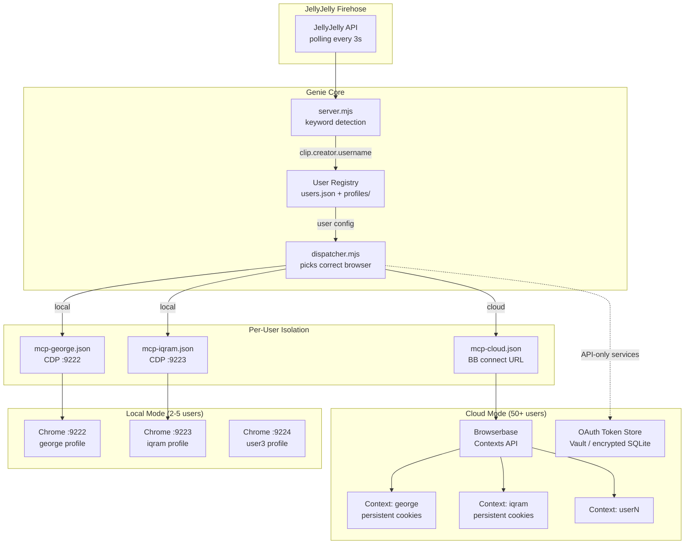

# Genie Multi-User Authentication Architecture

## Problem Statement

Genie currently runs one Chrome instance (`~/.genie/browser-profile`) on port 9222 with George's logged-in sessions. When a JellyJelly clip triggers a wish, the dispatcher spawns `claude -p` with `--mcp-config config/mcp.json` pointing at `http://127.0.0.1:9222`. Every user's wish executes as George. Iqram says "genie, post on my X" and it posts on George's X.

The fix: map each JellyJelly user to their own isolated browser context, and route the dispatcher to the correct one.

---

## Architecture Diagram



---

## 1. Local Multi-User (2-5 Users on One Mac)

### How It Works

Each user gets their own Chrome instance on a unique CDP port, with a separate `--user-data-dir`. The dispatcher reads the JellyJelly `creator.username` from the clip and looks up which port to target.

**User registry** (`~/.genie/users.json`):
```json
{
  "gtrushevskiy": {
    "cdpPort": 9222,
    "profileDir": "~/.genie/profiles/gtrushevskiy",
    "telegramChatId": "123456789",
    "services": ["x.com", "linkedin.com", "gmail.com", "ubereats.com"],
    "createdAt": "2026-04-04T00:00:00Z"
  },
  "iqram": {
    "cdpPort": 9223,
    "profileDir": "~/.genie/profiles/iqram",
    "telegramChatId": "987654321",
    "services": ["x.com", "linkedin.com"],
    "createdAt": "2026-04-04T12:00:00Z"
  }
}
```

**Chrome launch** -- one launchd plist per user, or a single manager process that spawns Chrome instances:

```bash
# Manager approach (simpler than N plists):
/Applications/Google\ Chrome.app/Contents/MacOS/Google\ Chrome \
  --user-data-dir=~/.genie/profiles/iqram \
  --remote-debugging-port=9223 \
  --remote-debugging-address=127.0.0.1 \
  --no-first-run --no-default-browser-check
```

**Dispatcher change** -- `dispatcher.mjs` currently hardcodes `config/mcp.json` which points at `:9222`. The fix: generate a per-user MCP config at dispatch time:

```javascript
// In dispatcher.mjs, before spawning claude -p:
const user = registry.getUser(clip.creator.username);
const mcpConfig = {
  mcpServers: {
    playwright: {
      command: "npx",
      args: ["-y", "@playwright/mcp@latest", "--cdp-endpoint",
             `http://127.0.0.1:${user.cdpPort}`]
    }
  }
};
const tmpMcpPath = `/tmp/genie-mcp-${user.username}.json`;
writeFileSync(tmpMcpPath, JSON.stringify(mcpConfig));
// Then: --mcp-config tmpMcpPath
```

**Storage**: ~200-400 MB per Chrome profile (cookies, localStorage, cache). 5 users = ~2 GB. Trivial.

**Port allocation**: Start at 9222, auto-increment. Cap at 9230 for sanity. A `chrome-manager.mjs` process tracks PIDs and health-checks each port on a 30s interval.

### Login Flow

User says "genie, set up my accounts" on JellyJelly (or triggers setup via Telegram DM to the Genie bot):

1. Genie detects the setup intent, sees no entry in `users.json` for this username
2. Launches a fresh Chrome on the next available port with a new profile dir
3. Opens login pages: `x.com/i/flow/login`, `linkedin.com/login`, `accounts.google.com`
4. Sends Telegram message: "Chrome is open on this machine. Log into your accounts, then say 'done'."
5. User physically walks over (this is local mode -- they're in the room) and logs in
6. Genie verifies sessions by hitting each service's authenticated endpoint
7. Writes the user entry to `users.json`

This only works when users have physical access to the Mac. That's fine for 2-5 people in a shared office or demo setting.

---

## 2. Cloud Multi-User (50+ Users)

### Option A: Browserbase Contexts (browser-based, any service)

[Browserbase](https://browserbase.com) provides persistent browser contexts at $0.10/hr. A "Context" is a saved cookie jar + localStorage that persists across sessions. You create a session, attach the context, and the browser loads with the user's cookies intact.

**Onboarding flow:**

1. User triggers setup (see Section 3 for UX)
2. Genie creates a Browserbase Context via API:
   ```
   POST https://api.browserbase.com/v1/contexts
   { "projectId": "genie-prod" }
   ```
3. Genie creates a session with that context and returns a **live view URL** (Browserbase provides this -- it's a noVNC-style screen share)
4. User opens the live view URL in their own browser -- they see a remote Chrome
5. User logs into their services in that remote Chrome. Genie never sees passwords -- the user types directly into the remote browser
6. Cookies are saved to the Context automatically
7. When Genie needs to act for this user, it creates a new session with their Context ID attached -- Chrome opens with their cookies pre-loaded

**Cost model**: If each wish takes ~3 min of browser time, and a user makes 10 wishes/day: 30 min/day = $0.05/day/user. 50 users = $2.50/day. 1000 users = $50/day. Manageable.

**Vendor choice**: Browserbase over alternatives (Hyperbrowser, Steel) because of the persistent Context primitive specifically. Steel has session replay but no persistent cookie contexts. Browserbase's Context API is purpose-built for this.

### Option B: OAuth Tokens (API-based, limited services)

For services with official APIs, skip the browser entirely:

| Service | API | OAuth Scope | Token Storage |
|---------|-----|-------------|---------------|
| X/Twitter | X API v2 | `tweet.write`, `users.read` | OAuth 2.0 PKCE, refresh tokens |
| LinkedIn | Marketing API | `w_member_social` | OAuth 2.0, 60-day tokens |
| Gmail | Gmail API | `gmail.compose`, `gmail.send` | OAuth 2.0, refresh tokens |
| GitHub | REST API v3 | `repo`, `gist` | OAuth App or PAT |
| Stripe | Stripe API | Stripe Connect | OAuth, `stripe_user_id` |

**When OAuth beats browser**: Faster execution (no DOM navigation), more reliable (no selector breakage), lower cost (no browser runtime). Use OAuth for posting/sending. Use browser for services without APIs (Uber Eats, OpenTable, Airbnb).

**Token storage**: Encrypted SQLite (`~/.genie/vault.db`) with AES-256-GCM, key derived from a master secret in env. In cloud: AWS Secrets Manager or Vault by HashiCorp. Never plaintext.

### Option C: Hybrid (recommended for production)

```
User wish arrives
  |
  v
Is target service in OAuth registry?
  YES --> Use stored OAuth token, call API directly
  NO  --> Spin up Browserbase session with user's Context, drive via Playwright
```

This gives you API speed for X/LinkedIn/Gmail (the common 80%) and browser fallback for everything else (Uber Eats, OpenTable, niche services).

---

## 3. Onboarding UX

### First Contact

User says "genie" for the first time in a JellyJelly clip. Genie detects the keyword, looks up `creator.username` in the registry, finds nothing.

**Flow:**

1. Genie posts a **reply clip** on JellyJelly (or sends a DM if JellyJelly supports it):
   > "Hey @iqram, I'm Genie. To grant wishes on your accounts, I need you to connect them. Tap this link to set up."

2. The link goes to `https://genie.sh/setup?user=iqram&token=<one-time-token>` -- a simple web app (Next.js on Vercel or a single HTML page).

3. **Setup page shows:**
   - "Connect your accounts" with buttons for each service
   - OAuth services (X, LinkedIn, Gmail, GitHub): standard "Sign in with X" OAuth buttons that redirect back with tokens. Genie never sees the password.
   - Browser services (Uber Eats, etc.): "Open remote browser" button that launches a Browserbase live view. User logs in directly.
   - Telegram connection: "Send /start to @GenieWishBot" -- the bot captures their `chat_id` for reporting.

4. **Telegram alternative** (no web app needed for MVP): Genie sends a Telegram message to a public channel or the user DMs @GenieWishBot:
   ```
   /connect x.com
   ```
   Bot replies with an OAuth URL. User clicks, authorizes, token flows back to Genie via callback.

5. **Consent screen** on each service:
   > "Allow Genie to post on your X account? This means Genie can tweet, reply, and like on your behalf when you ask."
   > [Allow] [Deny]
   Stored as `services` array in user registry. Genie checks this before every action.

### Revoking Access

- User says "genie, disconnect my X" -- Genie revokes the OAuth token and deletes the Browserbase Context cookies for that service
- Setup page has a "Manage connections" view showing active services with [Disconnect] buttons
- OAuth tokens: call the provider's revoke endpoint (`POST https://api.twitter.com/2/oauth2/revoke`)
- Browser contexts: delete the Context via Browserbase API or clear cookies for that domain

---

## 4. Security Model

### Per-User Credential Isolation

- **Local mode**: Each Chrome profile is a separate directory. Process isolation via OS -- Chrome instances run as the same Unix user but cannot access each other's `--user-data-dir`.
- **Cloud mode**: Browserbase Contexts are server-side isolated by Context ID. OAuth tokens encrypted at rest with per-user keys (user-specific salt + master key).
- **Code-level**: The dispatcher resolves the user BEFORE spawning Claude Code. The spawned process only receives the MCP config for that user's browser. It physically cannot reach another user's CDP port or Context.

### Consent Model

```javascript
// Before executing any browser/API action:
const user = registry.getUser(username);
const allowed = user.services.includes(targetService);
if (!allowed) {
  await sendMessage(user.telegramChatId,
    `Genie wants to act on ${targetService} but you haven't connected it. /connect ${targetService}`);
  return { skipped: true, reason: 'not_connected' };
}
```

Every wish execution checks the user's `services` whitelist. No blanket access.

### Audit Log

Every action Genie takes on a user's behalf is logged to `~/.genie/audit.jsonl` (local) or a dedicated table (cloud):

```json
{
  "ts": "2026-04-04T14:30:00Z",
  "user": "iqram",
  "clipId": "01JR...",
  "action": "tweet_post",
  "service": "x.com",
  "input": "Posted tweet about AI meetup",
  "result": "success",
  "tweetId": "1234567890",
  "sessionId": "claude-session-abc",
  "cost_usd": 0.12
}
```

Users can request their audit log via Telegram: `/history` returns last 20 actions.

### Token Rotation and Session Health

- **OAuth refresh tokens**: Cron job (`token-refresh.mjs`) runs every 12 hours, refreshes any token expiring within 24 hours. LinkedIn tokens expire every 60 days -- the job catches this.
- **Browser session health**: Before dispatching a wish that needs browser, hit an authenticated endpoint (e.g., `x.com/home` returns 200 vs redirect to login). If session is dead, notify user: "Your X session expired. Please re-login: [link]"
- **Stale context cleanup**: Contexts unused for 30 days get flagged. User gets a Telegram ping: "Your Genie connections are idle. Keep them? [Yes/Remove]"

---

## 5. Implementation Priority

### Phase 1: Local multi-user (1 week)
Ship this first. It's the minimum needed for the JellyJelly demo where 2-3 people in the room want to try Genie.

1. `src/core/user-registry.mjs` -- CRUD for `~/.genie/users.json`
2. `src/core/chrome-manager.mjs` -- launch/kill/health-check Chrome instances per user
3. Modify `dispatcher.mjs` to look up user and generate per-user MCP config
4. `npm run setup:user <username>` -- interactive setup that launches Chrome and opens login pages
5. Audit log to `~/.genie/audit.jsonl`

**Key change in dispatcher.mjs**: Line 26 currently hardcodes `MCP_CONFIG_PATH`. Replace with a function `getMcpConfigForUser(username)` that writes a temp JSON and returns the path.

### Phase 2: OAuth for X/LinkedIn/Gmail (1 week)
Add OAuth flows for the three most common services. Requires a tiny web server for OAuth callbacks.

1. `src/auth/oauth-server.mjs` -- Express on port 3847, handles `/callback/:service`
2. `src/auth/providers/x.mjs`, `linkedin.mjs`, `gmail.mjs` -- OAuth 2.0 PKCE flows
3. Encrypted token store in SQLite
4. Modify dispatcher to prefer API calls over browser for supported services

### Phase 3: Browserbase cloud (1 week)
For scaling beyond the local Mac.

1. `src/cloud/browserbase.mjs` -- Context CRUD, session creation, live view URL generation
2. Setup web page at `genie.sh/setup` for remote onboarding
3. Modify chrome-manager to support both local and Browserbase backends

### Phase 4: Production hardening (ongoing)
- Token rotation cron
- Session health monitoring
- Rate limiting per user
- Usage tracking and billing hooks (if Genie becomes a paid service)

---

## 6. Concrete Dispatcher Change

The single most important code change. Current `dispatcher.mjs` line 26:

```javascript
const MCP_CONFIG_PATH = resolve(REPO_ROOT, 'config/mcp.json');
```

Becomes:

```javascript
import { getUserConfig } from './user-registry.mjs';

function getMcpConfigPath(jellyUsername) {
  const user = getUserConfig(jellyUsername);
  if (!user) {
    // Fallback to default (George's) config for unknown users
    return resolve(REPO_ROOT, 'config/mcp.json');
  }

  const config = {
    mcpServers: {
      playwright: {
        command: "npx",
        args: [
          "-y", "@playwright/mcp@latest",
          "--cdp-endpoint", user.browserbaseContextId
            ? `wss://connect.browserbase.com?sessionId=${user.activeSessionId}`
            : `http://127.0.0.1:${user.cdpPort}`
        ]
      }
    }
  };

  const tmpPath = `/tmp/genie-mcp-${jellyUsername}.json`;
  writeFileSync(tmpPath, JSON.stringify(config));
  return tmpPath;
}
```

And in `dispatchToClaude()`, replace the static `MCP_CONFIG_PATH` reference with:
```javascript
const mcpConfigPath = getMcpConfigPath(creator);
// ...
'--mcp-config', mcpConfigPath,
```

That's it. One function swap in the dispatcher, and Genie becomes multi-user.
