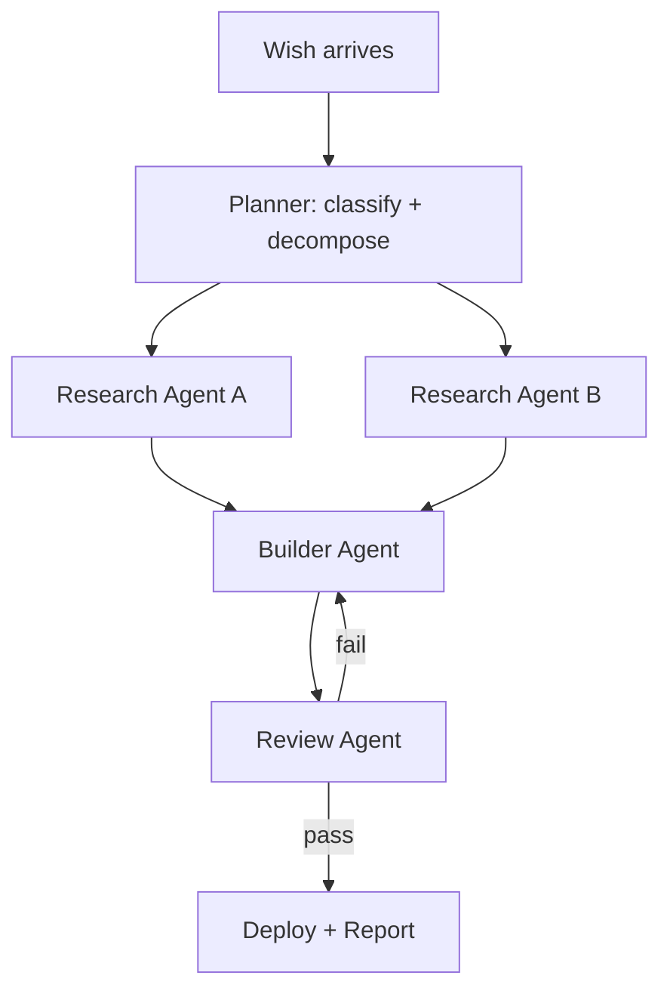
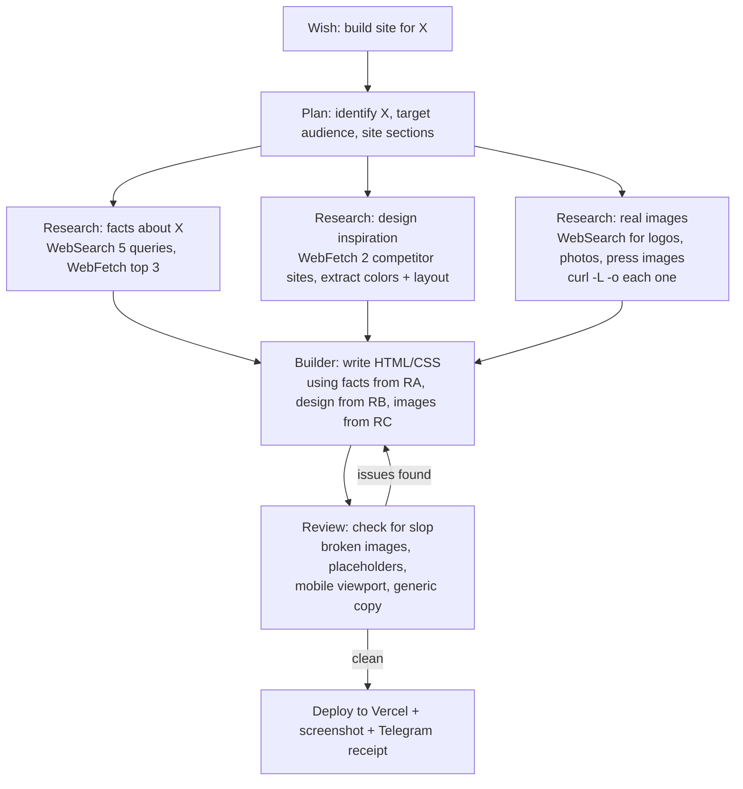
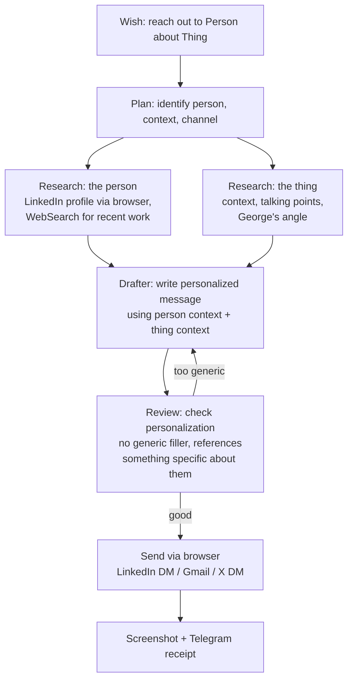
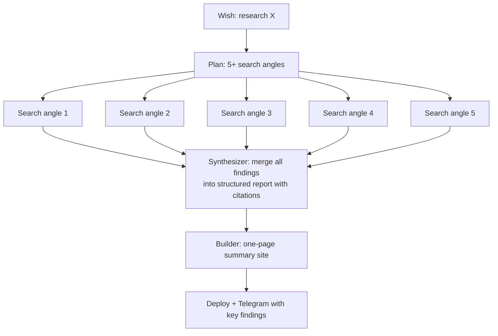

# Genie Subagent Orchestration Design

## The Core Insight

The current system spawns one `claude -p` that does everything sequentially: research, build, review, deploy, report. The Task tool lets that spawned agent create subagents that run in parallel and return results. This means the main Genie agent becomes an **orchestrator** — it plans the work, fans out to specialists, merges their output, and delivers a polished result.

The goal is not speed. It is **quality through specialization**. A research agent that spends 30 seconds on five WebSearch queries produces better facts than a builder agent that Googles once mid-build. A review agent that checks every image URL catches broken links the builder missed. Parallel work is a bonus — the real win is that each agent focuses on one job and does it well.

---

## 1. The General Orchestration Pattern

Every wish flows through this DAG:



**Sequential gates:**
- Planning MUST finish before anything else starts (it produces the task specs)
- Building MUST wait for research (otherwise you get generic slop)
- Review MUST happen before deploy (catches broken images, placeholder text, missing sections)

**Parallel lanes:**
- Multiple research agents run simultaneously (facts vs. design vs. people)
- Review failures loop back to the builder with specific fix instructions (max 2 loops)

---

## 2. Wish-Type Recipes

### BUILD wishes — "build me a site for X"



**Research Agent A** (facts): Runs 5 WebSearch queries about X from different angles — what is it, recent news, key people, competitive landscape, pricing. WebFetches the top 3 results. Returns a structured brief: `{ summary, keyFacts[], audience, competitors[] }`.

**Research Agent B** (design): WebFetches 2-3 competitor or similar landing pages. Extracts: color palette (hex values), layout pattern (hero + features + CTA vs. other), typography choices, any standout UI patterns. Returns: `{ colorScheme, layoutPattern, fontSuggestions, notablePatterns[] }`.

**Research Agent C** (assets): WebSearches for real images — company logos, event photos, headshots, relevant imagery. Downloads each with `curl -L -o` into the build folder. Returns: `{ images[{path, description, source}] }`.

**Builder Agent**: Receives all three research packets. Builds the HTML using real facts (not invented), real downloaded images (not Unsplash), and design patterns from the competitor analysis. The builder's prompt explicitly says: "You have real data — use it. Every fact must come from the research brief. Every image must be a local file that exists."

**Review Agent**: Checks the built HTML for:
- Placeholder text (Lorem ipsum, "Your Name Here", "Coming Soon" for real content, "[X]")
- Broken images (`curl -sI` each referenced file, verify it exists locally)
- Generic AI tells (centered everything, identical card heights, stock gradient backgrounds)
- Mobile layout (checks viewport meta tag exists, no fixed widths over 600px)
- Content accuracy (cross-references builder's copy against research agent's facts)

Returns either `{ pass: true }` or `{ pass: false, issues[] }`. On failure, the orchestrator sends issues back to the builder for a fix pass (max 2 rounds).

### OUTREACH wishes — "reach out to [person] about [thing]"



**Research Agent A** (person): Uses Playwright to search LinkedIn (logged in — gets full profiles). Also WebSearches their name + company. Returns: `{ name, title, company, recentActivity, mutualConnections, personalHooks[] }`.

**Research Agent B** (thing): WebSearches the topic/event/context. Returns: `{ summary, whyRelevant, talkingPoints[], georgesAngle }`.

**Drafter Agent**: Writes a message that references something specific from the person's profile (not "I saw your great work"). Uses the talking points from the thing research. Keeps it under 300 chars for LinkedIn, longer for email.

**Review Agent**: Checks that the message mentions at least one specific detail about the person that came from research. Rejects "I'd love to connect" without substance.

### RESEARCH wishes — "find out about X"



Five parallel search agents each take a different angle (what, who, when, why it matters, controversies/risks). Each returns `{ findings[], sources[] }`. The synthesizer merges, deduplicates, and produces a structured report. The builder turns it into a deployable one-pager.

### COMMERCE wishes — "order X from Uber Eats"

No subagent orchestration needed. The existing Uber Eats skill suite handles this well as a single sequential flow. Exception: for "find the cheapest/best place for X", one agent could search 3 stores in parallel and compare prices before the main agent starts the order.

---

## 3. Quality Gates — The Review Agent

The review agent is the most important addition. Its prompt includes a checklist:

**Content quality:**
- No placeholder text: scan for `Lorem`, `ipsum`, `Your Name`, `Coming Soon`, `[placeholder]`, `TODO`, `example.com` in visible content
- Facts match research: every claim in the HTML should trace back to something from the research agents
- No hallucinated URLs: every `href` and `src` either points to a local file or a URL that returns 200

**Visual quality:**
- Viewport meta tag present (`width=device-width, initial-scale=1`)
- No elements wider than `100vw` (horizontal scroll = broken)
- At least one Google Font loaded (not just system fonts)
- Color contrast: no light text on light bg or dark on dark
- Images have `alt` text

**Technical quality:**
- All local image files exist (`ls -la` each referenced path)
- External URLs return 200 (`curl -sI` each, check status)
- HTML is valid (no unclosed tags that break layout)
- No console errors in a quick Playwright render

The review agent returns structured feedback. On failure, the orchestrator sends the issues list to the builder with: "Fix ONLY these issues. Do not redesign. Do not rewrite sections that passed."

---

## 4. System Prompt Additions

Add this section to `config/genie-system.md`, replacing the current thin "Parallel work with Task subagents" section:

```markdown
## Orchestrating with Task subagents

For any wish that involves BOTH research AND building, break the work into
specialized subagents using the Task tool. This produces dramatically better
results than doing everything sequentially.

### When to orchestrate (effort dial)

- **Quick mode** (wish contains "quick", "fast", "simple", or is a single
  trivial action like "post a tweet"): Skip orchestration. Do it directly.
- **Full mode** (default for BUILD, OUTREACH, and RESEARCH wishes): Use the
  full subagent pipeline below.

### How Task works

Each Task call spawns an independent Claude Code subagent. It can use all your
tools (Bash, WebSearch, WebFetch, Read, Write, etc.) but NOT Playwright MCP
tools (browser actions stay in the main thread). The subagent runs to
completion and returns its result as a string.

To run agents in parallel, call multiple Task tools in the same response:

```
// These run simultaneously:
Task: "Research facts about Betaworks..."
Task: "Research design inspiration from competitor sites..."
Task: "Find and download real images for..."
```

Wait for all to complete, then use their results in the next step.

### BUILD wish orchestration

For "build me a site/page/app for X":

**Step 1 — Plan (you, the main agent):** Identify X, target audience, what
sections the site needs. Write this as a 3-sentence brief.

**Step 2 — Research (3 parallel Task agents):**

Task A — Facts:
  "Research [X]. Run 5 WebSearch queries from different angles: what it is,
   recent news, key people involved, competitive landscape, pricing/market.
   WebFetch the top 3 results for full text. Return a JSON object:
   { summary: string, keyFacts: string[], audience: string,
     competitors: string[] }. Only verified facts — no invention."

Task B — Design:
  "Find 2-3 landing pages for companies similar to [X]. WebFetch each one.
   Extract: primary colors (hex), layout pattern (hero+features+CTA vs other),
   font choices, standout UI elements. Return JSON:
   { colorScheme: {bg, text, accent}, layoutPattern: string,
     fonts: string[], patterns: string[] }"

Task C — Images:
  "Search the web for real images related to [X]: logos, photos, headshots,
   event imagery. Download each to /tmp/genie/SLUG/ with curl -L -o.
   Return JSON: { images: [{filename, description, sourceUrl}] }.
   Minimum 3 images. No Unsplash. No placeholder SVGs."

**Step 3 — Build (1 Task agent, receives research from A+B+C):**

  "Build index.html in /tmp/genie/SLUG/ for [X].
   RESEARCH FACTS: [paste Task A result]
   DESIGN DIRECTION: [paste Task B result]
   AVAILABLE IMAGES: [paste Task C result]
   Requirements: modern CSS (grid/flex, backdrop-filter, Google Fonts),
   dark theme, mobile responsive, all content from the research facts,
   all images referenced by local filename. No placeholder text anywhere."

**Step 4 — Review (1 Task agent):**

  "Review /tmp/genie/SLUG/index.html for quality.
   Check: (1) no placeholder text (Lorem, Your Name, Coming Soon, TODO),
   (2) all image files exist (ls each), (3) viewport meta tag present,
   (4) at least one Google Font, (5) all facts match this research brief:
   [paste Task A result]. Return { pass: true } or { pass: false, issues[] }."

If review fails, send issues back to builder (Step 3) for one fix pass.

**Step 5 — Deploy (you, the main agent):** Vercel deploy, screenshot, Telegram
receipt. This stays in the main thread because it needs Playwright for
screenshots and direct Telegram access.

### OUTREACH wish orchestration

**Step 1 — Research (2 parallel Tasks):**
- Task A: Research the person (LinkedIn search via WebSearch, company, recent work)
- Task B: Research the context/thing (what George wants to discuss, why it matters)

**Step 2 — Draft (1 Task):** Write the message using both research packets.
Must reference one specific detail about the person.

**Step 3 — Send (main agent):** Use Playwright MCP to send via LinkedIn/Gmail/X.
Screenshot the sent message. Report to Telegram.

### RESEARCH wish orchestration

Spawn 5 parallel Task agents, each searching from a different angle. Then one
synthesizer Task merges findings. Then one builder Task creates a summary page.
Deploy and report from the main thread.
```

---

## 5. The Effort Dial

**Implicit, not explicit.** Don't ask the user for a quality level — they can't answer (one-way wish). Instead, the main agent classifies automatically:

| Signal | Mode | Behavior |
|--------|------|----------|
| "quick", "fast", "just", "simple" in transcript | Quick | Single agent, no subagents, 60s target |
| Single discrete action ("post this tweet", "send a DM") | Quick | Single agent, direct execution |
| "real", "professional", "serious", "good" in transcript | Full | Complete subagent pipeline |
| BUILD wish (site, page, app) with no speed modifier | Full | Always orchestrate — sites are the most visible output |
| RESEARCH wish | Full | Always orchestrate — depth is the whole point |
| OUTREACH wish | Full | Always research the person first |
| COMMERCE wish (Uber Eats) | Quick | Skill suite handles it, no orchestration needed |

The planner step (which the main agent does inline, not as a subagent) makes this classification in under 5 seconds. It's a single paragraph of reasoning, not an LLM call.

---

## 6. Implementation Sequence

1. **Update `config/genie-system.md`** — Replace the one-liner about Task with the full orchestration section above.
2. **Test with a BUILD wish** — Record a JellyJelly clip saying "Genie, build me a real site for a consulting business called TRU Advisory". Compare output quality with vs. without orchestration.
3. **Tune the research prompts** — The Task descriptions above are starting points. After 3-5 real wishes, refine based on what the research agents actually return.
4. **Add review agent prompts as a skill** — Once the review checklist stabilizes, save it as `~/.claude/skills/genie-review/SKILL.md` so it stays consistent.

No changes to `dispatcher.mjs` needed. The orchestration happens entirely inside the spawned Claude Code agent — it uses the Task tool that's already in the allowed tools list. The dispatcher just sees more tool_use events streaming back.

---

## Constraints and Gotchas

- **Task agents cannot use Playwright MCP.** Browser actions must stay in the main thread. This means: research agents use WebSearch/WebFetch, not the browser. The main agent handles LinkedIn searches, sending DMs, taking screenshots.
- **Task agents share the filesystem.** Images downloaded by Research Agent C are immediately available to the Builder Agent if they write to the same `/tmp/genie/SLUG/` folder. Use this — it avoids passing large blobs through return values.
- **Task return values are strings.** Structure them as JSON so the orchestrator can parse and forward cleanly.
- **Budget awareness.** Each Task subagent consumes tokens from the same $25 budget. Five research agents running broad searches could burn $3-5 before building starts. The planner should be proportionate — a simple personal site doesn't need five research angles.
- **Max 2 review loops.** If the builder can't fix issues after 2 passes, deploy what you have and note the issues in the Telegram receipt. Perfectionism that burns the whole budget is worse than shipping something 90% good.
