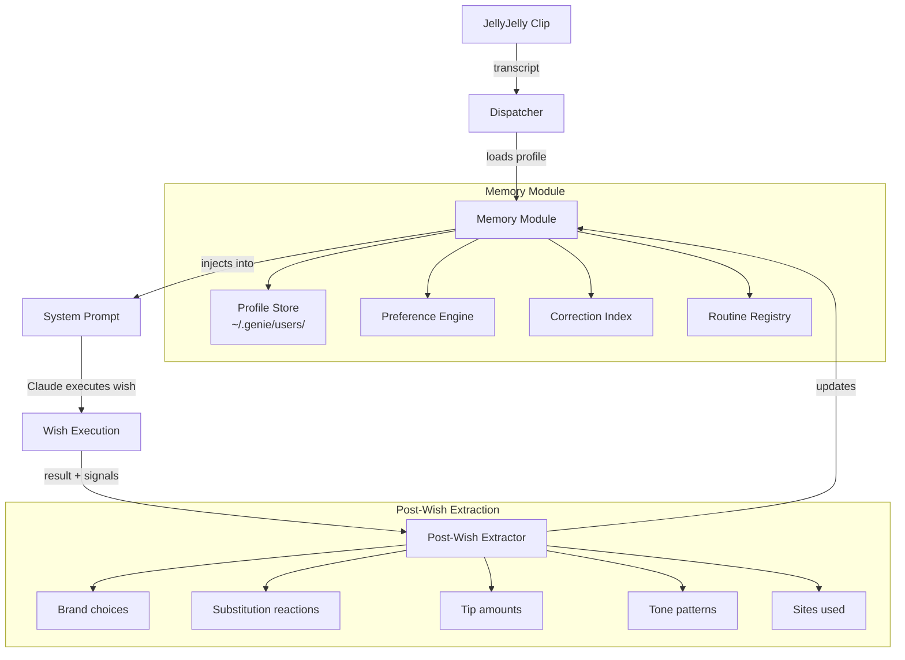
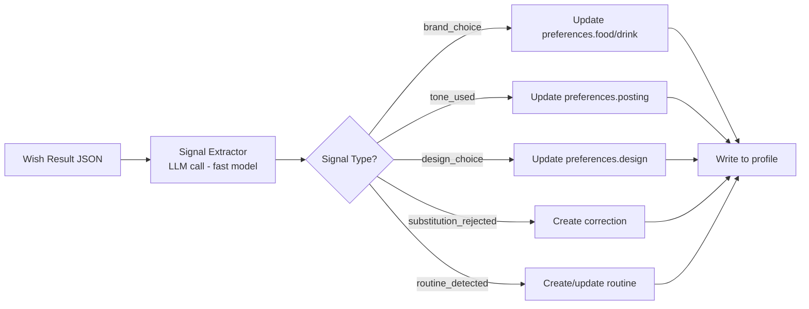
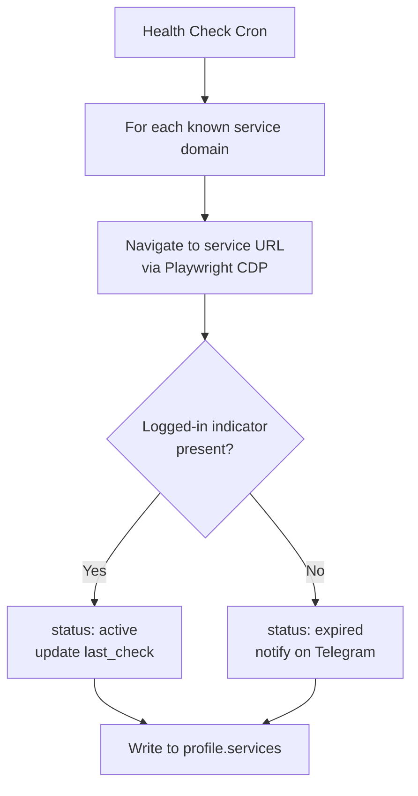
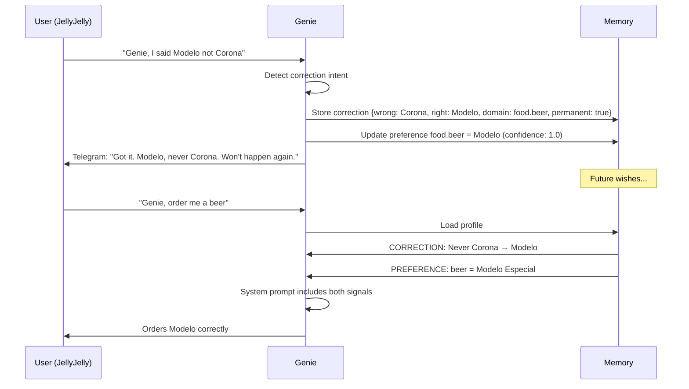
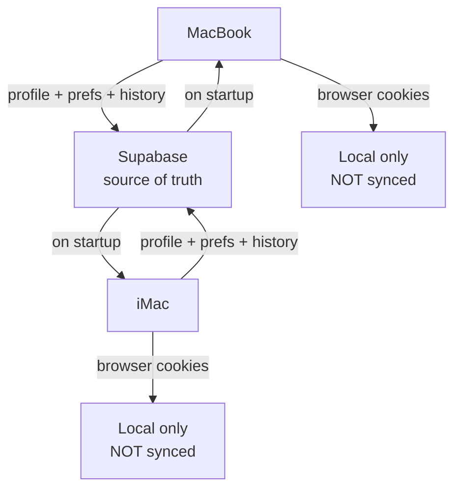

# 02 — User Memory & Personalization System

## Overview

Genie's current memory is a flat JSON file per user at `~/.genie/users/{username}.json` that tracks wish count and a list of past wishes. This doc designs the complete replacement: a layered memory system that makes Genie get smarter with every interaction.

---

## 1. User Profile Schema

```jsonc
{
  // === Identity ===
  "id": "usr_a1b2c3",                         // internal UUID
  "jelly_username": "georgy",
  "telegram_chat_id": "582706965",
  "name": "George Trushevskiy",
  "location": "NYC / Betaworks, Meatpacking",
  "timezone": "America/New_York",
  "first_seen": "2026-04-04T18:30:00Z",
  "last_seen": "2026-04-06T14:22:00Z",

  // === Connected Services ===
  "services": {
    "x":         { "status": "active", "username": "@gabortrush", "last_check": "2026-04-06T14:00:00Z" },
    "linkedin":  { "status": "active", "profile_url": "linkedin.com/in/georgetrushevskiy", "last_check": "..." },
    "gmail":     { "status": "active", "email": "george@...", "last_check": "..." },
    "uber_eats": { "status": "active", "last_check": "..." },
    "vercel":    { "status": "active", "last_check": "..." },
    "stripe":    { "status": "active", "mode": "test", "last_check": "..." },
    "github":    { "status": "active", "username": "gtrush", "last_check": "..." },
    "airbnb":    { "status": "none" },
    "opentable": { "status": "none" }
  },

  // === Addresses ===
  "addresses": {
    "default": "Betaworks, 235 W 18th St, New York, NY 10011",
    "home": null
  },

  // === Payment ===
  "payment": {
    "uber_eats": "Visa ****0140",
    "stripe_mode": "test"
  },

  // === Preferences (learned + explicit) ===
  "preferences": {
    "food": {
      "beer": { "value": "Modelo Especial", "fallback": "Pacifico", "source": "correction", "confidence": 1.0 },
      "grocery_staples": ["tomatoes", "Heineken 0.0"],
      "delivery_tip": "18%",
      "favorite_stores": ["Morton Williams", "Trader Joe's"]
    },
    "posting": {
      "default_platform": "x",
      "tone": "casual, emoji-light, personal voice",
      "avoid": ["corporate jargon", "hashtag spam"]
    },
    "design": {
      "aesthetic": "obsidian-gold-minimal",
      "bg": "#050505",
      "accent": "#928466",
      "font": "Inter",
      "style_tokens": ["backdrop-blur", "glass panels", "dark mode"]
    },
    "outreach": {
      "sign_off": "George",
      "tone": "warm, direct, no fluff"
    }
  },

  // === Corrections (highest priority) ===
  "corrections": [
    {
      "id": "cor_001",
      "date": "2026-04-05T20:15:00Z",
      "domain": "food.beer",
      "wrong": "Corona",
      "right": "Modelo Especial",
      "context": "Uber Eats beer ordering",
      "permanent": true
    }
  ],

  // === Routines / Shorthands ===
  "routines": {
    "my_usual": {
      "type": "uber_eats_order",
      "source_wish_id": "wish_042",
      "items": [
        { "store": "Morton Williams", "item": "Modelo Especial 6-pack", "qty": 1 },
        { "store": "Morton Williams", "item": "Heineken 0.0 6-pack", "qty": 1 },
        { "store": "Morton Williams", "item": "Tomatoes (Roma)", "qty": 4 }
      ],
      "last_used": "2026-04-05T19:00:00Z",
      "use_count": 3
    },
    "post_about_this": {
      "type": "social_post",
      "platform": "x",
      "tone": "casual",
      "include_link": true
    },
    "build_me_a_site": {
      "type": "build",
      "design_tokens": "preferences.design",
      "deploy_to": "vercel"
    }
  },

  // === Wish History (last 100, older archived) ===
  "wishes": [
    {
      "id": "wish_042",
      "date": "2026-04-05T19:00:00Z",
      "clip_id": "01KNC...",
      "transcript": "Genie, order my usual...",
      "type": "ORDER",
      "status": "completed",
      "result": {
        "order_id": "UE-abc123",
        "total": "$28.47",
        "items_delivered": ["Modelo 6pk", "Heineken 0.0 6pk", "Roma tomatoes x4"]
      },
      "duration_s": 187,
      "cost_usd": 0.42
    }
  ],

  // === Learning Log (raw signal for preference extraction) ===
  "learning_log": [
    {
      "date": "2026-04-05T19:05:00Z",
      "wish_id": "wish_042",
      "signals": [
        { "type": "brand_choice", "domain": "food.beer", "chose": "Modelo Especial", "over": null },
        { "type": "tip_amount", "domain": "food.delivery_tip", "value": "18%" },
        { "type": "store_used", "domain": "food.favorite_stores", "value": "Morton Williams" }
      ]
    }
  ]
}
```

---

## 2. Storage Architecture

```
~/.genie/
  users/
    georgy.json          ← hot profile (< 500KB, loaded every wish)
    georgy.archive.json  ← cold: wishes older than 90 days, full learning log
  sync/
    manifest.json        ← device ID, last sync timestamp, conflict version
```

**Why local JSON (for now):**
- Genie runs as a local server on the user's machine. No cloud dependency.
- Sub-1ms reads. No auth overhead. Works offline.
- Single user per machine is the 90% case.

**Migration path (when multi-user matters):**
- Phase 1 (now): Local JSON. Single machine.
- Phase 2: Supabase for cloud sync. Local JSON remains the read cache. Supabase is the source of truth. Sync on startup + every 5 minutes + on wish completion.
- Phase 3: Redis for hot preferences (sub-ms across devices), Supabase for durable storage.

The schema is identical regardless of backend. The `memory.mjs` module abstracts storage -- callers never touch files directly.

---

## 3. Data Flow



---

## 4. Preference Learning Pipeline

After every completed wish, a `postWishExtract()` function runs:



**Signal extraction prompt (appended to the wish result):**

```
Analyze this completed wish and extract preference signals.
Return JSON array of signals, each with:
  { type, domain, value, confidence }

Types: brand_choice, store_preference, tip_amount, tone_used,
       design_choice, substitution_accepted, substitution_rejected,
       routine_candidate, time_preference

Only extract signals with confidence > 0.7. Do not invent signals.
```

**Confidence decay:** Preferences that haven't been reinforced in 60 days drop confidence by 0.1 per month. Corrections never decay -- they are permanent unless the user explicitly revokes them.

**Conflict resolution priority (highest to lowest):**
1. Corrections (`corrections[]`) -- always win
2. Explicit statements ("I prefer Modelo") -- confidence 1.0
3. Repeated behavior (3+ times) -- confidence 0.9
4. Single observation -- confidence 0.6
5. Inferred from context -- confidence 0.4

---

## 5. Shorthand / "My Usual" System

Routines are registered two ways:

**Auto-detected:** When a user repeats a substantially similar wish 3+ times, the system proposes a routine:
```
Telegram: "I noticed you've ordered Modelo + Heineken 0.0 + tomatoes
three times. Want me to save this as 'my usual'?"
```

**Explicit:** "Genie, save this order as my usual" or "Genie, from now on when I say 'post about this' I mean post on X."

**Resolution at wish time:**

```javascript
function resolveRoutine(transcript, profile) {
  const triggers = {
    'my usual':        profile.routines.my_usual,
    'the usual':       profile.routines.my_usual,
    'post about this': profile.routines.post_about_this,
    'build me a site': profile.routines.build_me_a_site,
  };
  for (const [phrase, routine] of Object.entries(triggers)) {
    if (transcript.toLowerCase().includes(phrase) && routine) {
      return routine;
    }
  }
  return null;
}
```

The resolved routine gets injected into the system prompt as a concrete spec, so Claude doesn't have to guess.

---

## 6. Account Info Indexing

Genie needs to know what the user is logged into so it doesn't attempt actions on unavailable services.

**Health check flow (runs on server startup + every 6 hours):**



**Detection heuristics per service:**

| Service | URL to check | Logged-in signal |
|---------|-------------|------------------|
| X | `x.com/home` | Compose button visible |
| LinkedIn | `linkedin.com/feed` | No login redirect |
| Gmail | `mail.google.com` | Inbox element present |
| Uber Eats | `ubereats.com` | Account icon visible |
| Vercel | `vercel.com/dashboard` | No login redirect |
| GitHub | `github.com` | Avatar dropdown present |

**Injected into system prompt as:**
```
AVAILABLE SERVICES: X, LinkedIn, Gmail, Uber Eats, Vercel, GitHub, Stripe
UNAVAILABLE (not logged in): Airbnb, OpenTable, Calendly
Do NOT attempt actions on unavailable services.
```

---

## 7. Correction Loop



Corrections are stored as first-class objects, not just preference overrides, because they carry negative signal ("never do X") which is harder to express as a preference alone.

**Correction extraction prompt:**
```
The user said: "{transcript}"
Is this a correction of a previous action? If yes, extract:
{ "wrong": "what was done incorrectly", "right": "what should have been done",
  "domain": "category.subcategory", "context": "when this applies" }
If not a correction, return null.
```

---

## 8. Privacy & Data Lifecycle

**Local-only by default.** No data leaves the machine unless the user enables cloud sync.

| Data | Location | Encrypted | Cloud sync |
|------|----------|-----------|------------|
| Profile + preferences | `~/.genie/users/` | At rest via macOS FileVault | Opt-in (Supabase) |
| Wish transcripts | `~/.genie/users/` | At rest via macOS FileVault | Opt-in |
| Browser cookies | `~/.genie/browser-profile/` | Never synced | Never |
| Payment method labels | Profile JSON (masked) | At rest | Opt-in |
| Actual credentials/tokens | `.env` only | Never in profile | Never |

**"Genie, forget everything about me":**
```javascript
export function forgetUser(username) {
  const path = userPath(username);
  const archivePath = userPath(username).replace('.json', '.archive.json');
  if (existsSync(path)) unlinkSync(path);
  if (existsSync(archivePath)) unlinkSync(archivePath);
  // If cloud sync enabled, delete from Supabase too
  if (SYNC_ENABLED) await supabase.from('profiles').delete().eq('jelly_username', username);
  return { deleted: true, message: "All your data has been erased." };
}
```

**Data export:** "Genie, export my data" generates a ZIP of the profile JSON + wish history + corrections. Sent as a Telegram file attachment.

**Retention:** Wish history older than 90 days moves to the archive file. Archive older than 1 year is auto-deleted unless the user opts into permanent history.

---

## 9. Multi-Device Continuity



**What syncs:** Profile, preferences, corrections, routines, wish history.
**What stays local:** Browser profile/cookies, `.env` credentials, service login sessions.

**Conflict resolution:** Last-write-wins for preferences. Corrections merge (union of both sets). Wish history merges by `wish.id` (UUIDs, no duplicates).

**Practical reality:** Most users run Genie on one machine. Multi-device is a Phase 2 concern. The schema supports it now so we don't have to migrate later.

---

## 10. System Prompt Injection

The dispatcher already loads `config/genie-system.md` via `--append-system-prompt`. User memory gets prepended as a dynamic section before the wish transcript.

**Format in `dispatcher.mjs`:**

```javascript
function buildUserContext(profile) {
  if (!profile) return '';

  const sections = [];
  sections.push(`## User: ${profile.name} (@${profile.jelly_username})`);
  sections.push(`Location: ${profile.location} | TZ: ${profile.timezone}`);
  sections.push(`Wishes completed: ${profile.wishes?.length || 0}`);

  // Services
  const active = Object.entries(profile.services || {})
    .filter(([_, v]) => v.status === 'active').map(([k]) => k);
  const inactive = Object.entries(profile.services || {})
    .filter(([_, v]) => v.status !== 'active').map(([k]) => k);
  sections.push(`\nAVAILABLE SERVICES: ${active.join(', ')}`);
  if (inactive.length) sections.push(`UNAVAILABLE: ${inactive.join(', ')} — do NOT attempt these.`);

  // Corrections (HIGHEST PRIORITY)
  if (profile.corrections?.length) {
    sections.push('\nCORRECTIONS (override everything else):');
    for (const c of profile.corrections) {
      sections.push(`- NEVER ${c.wrong} → ALWAYS ${c.right} (context: ${c.context})`);
    }
  }

  // Preferences
  const prefs = profile.preferences || {};
  if (Object.keys(prefs).length) {
    sections.push('\nPREFERENCES:');
    if (prefs.food) {
      if (prefs.food.beer) sections.push(`- Beer: ${prefs.food.beer.value} (fallback: ${prefs.food.beer.fallback})`);
      if (prefs.food.delivery_tip) sections.push(`- Delivery tip: ${prefs.food.delivery_tip}`);
      if (prefs.food.favorite_stores?.length) sections.push(`- Preferred stores: ${prefs.food.favorite_stores.join(', ')}`);
    }
    if (prefs.posting) {
      sections.push(`- Posting tone: ${prefs.posting.tone}`);
      sections.push(`- Default platform: ${prefs.posting.default_platform}`);
    }
    if (prefs.design) {
      sections.push(`- Design: ${prefs.design.aesthetic} (bg: ${prefs.design.bg}, accent: ${prefs.design.accent})`);
    }
  }

  // Active routines
  if (profile.routines && Object.keys(profile.routines).length) {
    sections.push('\nSHORTHANDS:');
    for (const [name, r] of Object.entries(profile.routines)) {
      sections.push(`- "${name}": ${JSON.stringify(r.items || r.platform || r.type)}`);
    }
  }

  // Recent wish context (last 3)
  const recent = (profile.wishes || []).slice(-3);
  if (recent.length) {
    sections.push('\nRECENT WISHES:');
    for (const w of recent) {
      sections.push(`- [${w.date}] ${w.type}: ${w.result?.items_delivered?.join(', ') || w.transcript?.slice(0, 80)}`);
    }
  }

  return sections.join('\n');
}
```

**Concrete example for George:**

```markdown
## User: George Trushevskiy (@georgy)
Location: NYC / Betaworks, Meatpacking | TZ: America/New_York
Wishes completed: 42

AVAILABLE SERVICES: x, linkedin, gmail, uber_eats, vercel, stripe, github
UNAVAILABLE: airbnb, opentable — do NOT attempt these.

CORRECTIONS (override everything else):
- NEVER Corona → ALWAYS Modelo Especial (context: beer ordering on Uber Eats)

PREFERENCES:
- Beer: Modelo Especial (fallback: Pacifico)
- Delivery tip: 18%
- Preferred stores: Morton Williams, Trader Joe's
- Posting tone: casual, emoji-light, personal voice
- Default platform: x
- Design: obsidian-gold-minimal (bg: #050505, accent: #928466)

SHORTHANDS:
- "my_usual": [{"store":"Morton Williams","item":"Modelo Especial 6-pack","qty":1},{"store":"Morton Williams","item":"Heineken 0.0 6-pack","qty":1},{"store":"Morton Williams","item":"Tomatoes (Roma)","qty":4}]
- "post_about_this": "x" (casual tone, include link)
- "build_me_a_site": vercel deploy, obsidian-gold tokens

RECENT WISHES:
- [2026-04-05T19:00:00Z] ORDER: Modelo 6pk, Heineken 0.0 6pk, Roma tomatoes x4
- [2026-04-05T15:30:00Z] BUILD: AI Builders NYC landing page → genie-ai-builders.vercel.app
- [2026-04-04T22:00:00Z] OUTREACH: LinkedIn DM to Sarah Chen re: Betaworks collab
```

This block is prepended to the wish transcript before being passed to `claude -p`. Total overhead: ~600 tokens for a well-populated profile. Negligible relative to the 8KB system prompt.

---

## 11. Implementation Plan

**Files to create/modify:**

| File | Action | Description |
|------|--------|-------------|
| `src/core/memory.mjs` | Rewrite | Full profile CRUD, preference engine, correction store, routine registry |
| `src/core/preference-extractor.mjs` | New | Post-wish signal extraction (LLM call) |
| `src/core/service-health.mjs` | New | Browser-based login status checker |
| `src/core/dispatcher.mjs` | Modify | Add `buildUserContext()`, prepend to wish prompt |
| `config/genie-system.md` | Modify | Add `{USER_CONTEXT}` placeholder documentation |

**Migration from current `memory.mjs`:** The existing `getUser`/`updateUser`/`addWish` signatures are preserved. The new module extends them. Old user JSON files are auto-migrated on first read (missing fields get defaults).

**Estimated effort:** 2-3 focused sessions. Memory rewrite (session 1), preference extractor + service health (session 2), dispatcher integration + testing (session 3).
