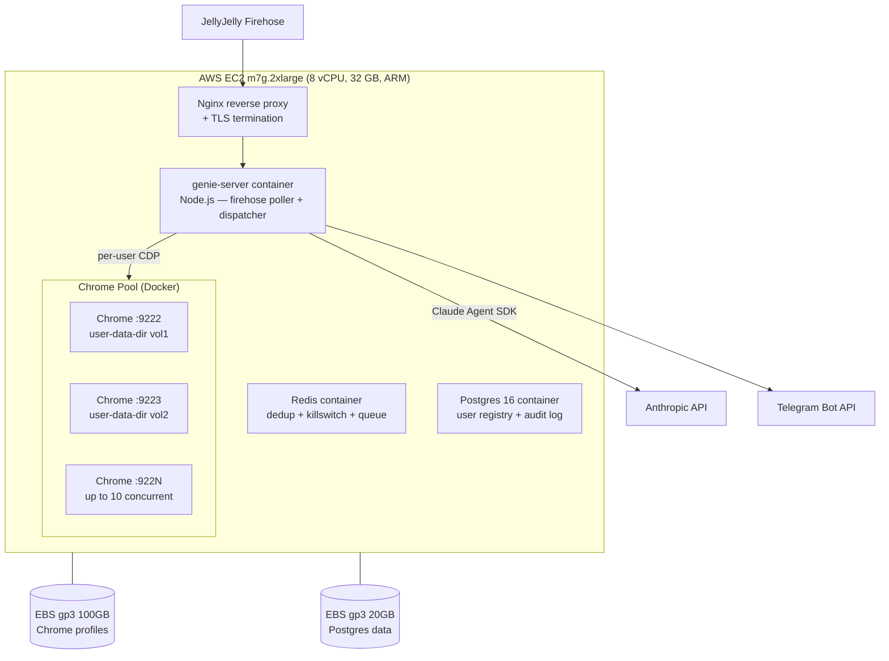
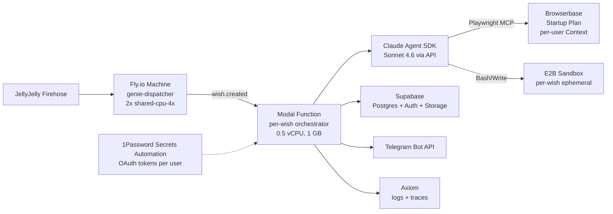
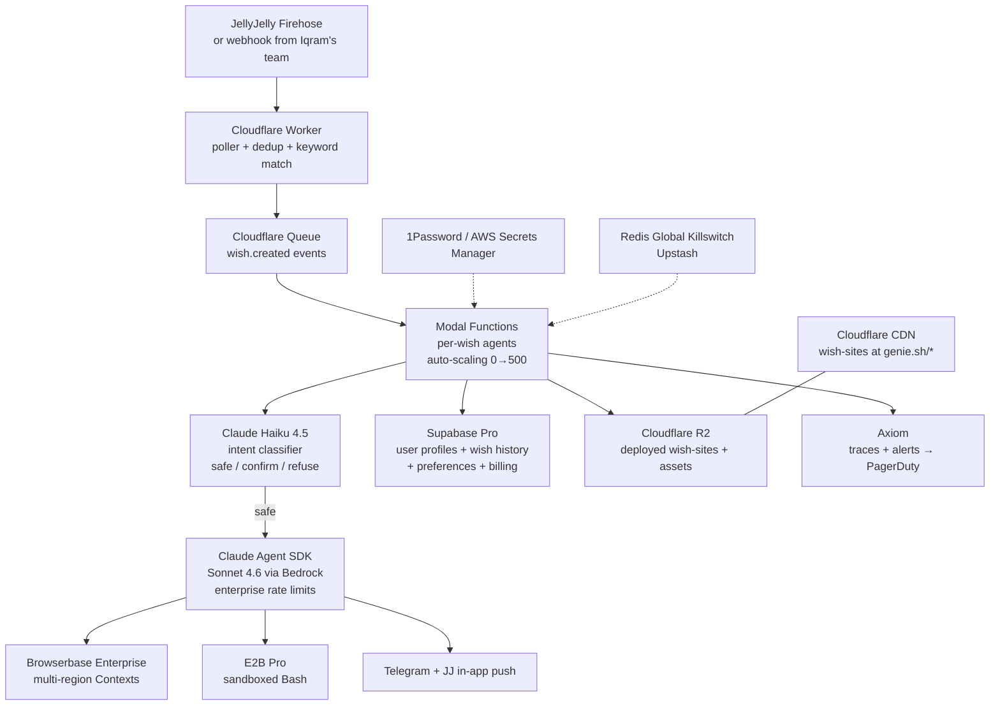
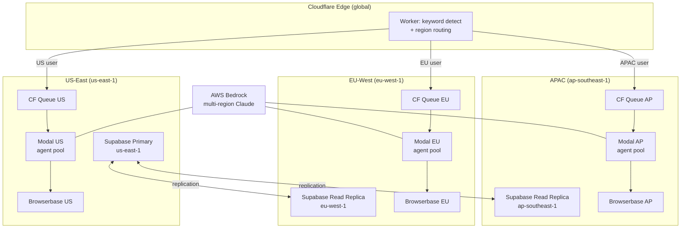

# Genie Cloud Deployment Architecture

**From one Mac to 100K users in four stages.**

Current state: Node server (launchd) + Chrome (launchd, CDP :9222) + `claude -p` (spawned per wish) + Playwright MCP. All local. Per-wish cost ~$0.19.

---

## Stage 1: Single VM (10-50 Users)

**What:** One beefy EC2 instance running everything in Docker Compose. Good enough for private alpha with JellyJelly insiders.



### Specs and Pricing

| Item | Spec | Monthly Cost |
|------|------|-------------|
| EC2 m7g.2xlarge | 8 vCPU, 32 GB RAM, ARM Graviton3 | $197 (1yr reserved) |
| EBS gp3 | 120 GB total | $10 |
| Elastic IP | 1 | $4 |
| Data transfer | ~50 GB out | $5 |
| Claude API (50 users x 3 wishes/day x 30 days) | 4,500 wishes x $0.175 | $788 |
| **Total** | | **~$1,004/mo** |

Sources: [EC2 pricing](https://aws.amazon.com/ec2/pricing/on-demand/), [Anthropic pricing](https://docs.anthropic.com/en/docs/about-claude/pricing)

### Key Decisions
- **Docker Compose** with `browserless/chrome` containers (one per active user, max 10 concurrent). Each container mounts a named volume for its `user-data-dir`.
- **Claude Agent SDK (TypeScript)** replaces `claude -p` subprocess. Same tools, same MCP support, no spawn gymnastics. The dispatcher calls `query()` directly.
- **Postgres** for user registry, wish history, audit log. SQLite is fine for 10 users but becomes a bottleneck with concurrent writes.
- **Redis** for clip dedup set, per-user rate limits, and the global killswitch flag.

### Single Points of Failure
| SPOF | Mitigation |
|------|-----------|
| EC2 instance dies | Daily EBS snapshots, AMI backup, <30 min recovery |
| Chrome OOMs | Docker restart policy `unless-stopped`, 3 GB memory limit per container |
| Postgres corruption | pg_dump cron every 6 hours to S3 |

### Migration to Stage 2
1. Replace Chrome containers with Browserbase API calls (swap CDP endpoint)
2. Extract dispatcher into a standalone service image
3. Move Postgres to Supabase (pg_dump import)

---

## Stage 2: Managed Services (50-1,000 Users)

**What:** Replace every self-hosted component with a managed equivalent. The Node server becomes a thin dispatcher. No Chrome containers to babysit.



### Changes from Stage 1
| Component | Stage 1 | Stage 2 |
|-----------|---------|---------|
| Chrome | Self-hosted Docker containers | Browserbase Contexts ($0.10/hr) |
| Orchestrator | Node process on EC2 | Modal Functions (per-second billing) |
| Bash sandbox | Runs in Docker on same VM | E2B sandbox (isolated, $0.10/hr) |
| Database | Postgres container | Supabase Pro ($25/mo) |
| Dispatcher | Node on EC2 | Fly.io Machine ($14/mo for 2x) |
| Secrets | .env file + encrypted SQLite | 1Password Secrets Automation |
| Logs | stdout + file | Axiom ($25/mo) |

### Cost Estimate (500 users, 3 wishes/day)

| Item | Calculation | Monthly |
|------|------------|---------|
| Claude API | 45K wishes x $0.175 | $7,875 |
| Browserbase Startup | $99/mo base + overage (1,500 hrs x $0.10) | $249 |
| E2B Pro | 45K wishes x 2 min x $0.10/hr | $150 |
| Modal | 45K invocations x 2 min x $0.0000131/CPU-s | $71 |
| Fly.io | 2 shared-cpu-4x machines | $28 |
| Supabase Pro | | $25 |
| Axiom | Team plan | $25 |
| 1Password | ~500 secrets x $0.40 | $200 |
| **Total** | | **~$8,623/mo** |
| **Per user/mo** | | **$17.25** |

Sources: [Browserbase](https://www.browserbase.com/pricing), [Modal](https://modal.com/pricing), [E2B](https://e2b.dev/pricing), [Fly.io](https://fly.io/docs/about/pricing/), [Supabase](https://supabase.com/pricing)

### Single Points of Failure
| SPOF | Mitigation |
|------|-----------|
| Fly.io dispatcher down | 2 machines with health checks, auto-restart |
| Browserbase outage | Steel.dev hot standby (identical Contexts API) |
| Modal outage | Queue wishes in Supabase, drain when Modal recovers |
| Supabase outage | Daily pg_dump to S3, Neon as cold standby |

---

## Stage 3: Full Scale (1,000-100,000 Users)

**What:** Event-driven architecture. Edge dispatch, queued execution, per-user state, enterprise contracts for rate limits and pricing.



### Changes from Stage 2
| Component | Stage 2 | Stage 3 |
|-----------|---------|---------|
| Firehose poller | Fly.io Machine | Cloudflare Worker (edge, $0.30/M requests) |
| Event bus | Direct Modal call | Cloudflare Queues (decoupled, $0.40/M messages) |
| Claude API | Direct Anthropic API | AWS Bedrock (higher rate limits, regional) |
| Intent filter | None | Haiku 4.5 classifier ($0.001/wish) |
| Browserbase | Startup plan | Enterprise contract (40%+ discount) |
| Site hosting | Vercel | Cloudflare R2 + CDN (cheaper at volume) |
| Monitoring | Axiom logs only | Axiom + PagerDuty alerts |
| Killswitch | Redis on Fly | Upstash Redis (serverless, global) |

### Cost Estimates

**At 10K DAU (3 wishes/day = 900K wishes/mo):**

| Item | Monthly |
|------|---------|
| Claude API (Bedrock, ~20% discount) | $126,000 |
| Browserbase Enterprise (negotiated $0.06/hr) | $1,800 |
| E2B Pro | $3,000 |
| Modal | $1,420 |
| Cloudflare Workers + Queues + R2 | $200 |
| Supabase Pro | $25 |
| Axiom + PagerDuty | $150 |
| Upstash Redis | $20 |
| Secrets management | $2,000 |
| **Total** | **~$134,615/mo** |
| **Per user/mo** | **$13.46** |

**At 100K DAU (3 wishes/day = 9M wishes/mo):**

| Item | Monthly |
|------|---------|
| Claude API (Bedrock committed use, ~30% discount) | $1,102,500 |
| Browserbase Enterprise (negotiated $0.04/hr) | $12,000 |
| E2B | $30,000 |
| Modal (committed use) | $10,000 |
| Cloudflare (all services) | $1,500 |
| Supabase Enterprise | $500 |
| Observability + alerting | $1,000 |
| Secrets management (Vault self-hosted) | $3,000 |
| **Total** | **~$1,160,500/mo** |
| **Per user/mo** | **$11.61** |

Claude API is 85-95% of total cost at every scale. All infrastructure optimization combined saves less than a 5% model price reduction would.

### Database Choice: Supabase

| Option | Verdict |
|--------|---------|
| **Supabase** (Postgres + Auth + Realtime + Storage) | **Winner.** Auth handles user onboarding, Realtime powers live wish status, Storage holds screenshots. One vendor, one bill. |
| PlanetScale | MySQL-based, no native auth/storage bundle. Wrong fit. |
| Neon | Excellent serverless Postgres, but no auth/storage. Good cold standby. |
| Self-hosted Postgres | Only at 100K+ if Supabase costs become unreasonable. |

### Queue/Event Bus: Cloudflare Queues

| Option | Verdict |
|--------|---------|
| **Cloudflare Queues** | **Winner for Stage 3.** Already on CF for Workers. $0.40/M messages. Dead-letter support. Simple. |
| SQS | Works but adds AWS dependency when dispatch is on CF edge. |
| Redis Streams (Upstash) | Good for killswitch, overkill for wish queue at this scale. |
| Kafka | Way too heavy until 500K+ DAU with multi-consumer patterns. |

### SLA Targets

| Metric | Target | Measurement |
|--------|--------|-------------|
| Wish detection latency | <20s from clip post | Timestamp diff: `posted_at` vs `wish.created` event |
| Wish completion rate | >92% | Wishes that reach Telegram receipt / total dispatched |
| Wish execution time (p50) | <3 minutes | Modal function duration |
| Platform uptime | 99.5% | Synthetic monitors on poller + dispatcher |
| Data durability | 99.99% | Supabase managed backups + S3 snapshots |

---

## Stage 4: Global (100K+ Users)

**What:** Multi-region deployment. Wishes route to the nearest region. Browser sessions are regionalized.



### Changes from Stage 3
| Component | Stage 3 | Stage 4 |
|-----------|---------|---------|
| Dispatch | Single-region CF Worker | Edge Worker with geo-routing |
| Queues | 1 queue | 3 regional queues |
| Modal | US-only | US + EU + APAC regions |
| Browserbase | Single region | Multi-region (enterprise feature) |
| Database | Single Supabase instance | Primary + 2 read replicas |
| Bedrock | us-east-1 only | Cross-region inference profiles |

### Cost Optimization at Scale

| Strategy | Savings |
|----------|---------|
| Bedrock committed throughput (1yr) | 20-30% on Claude API |
| Browserbase enterprise annual contract | 40-60% on browser hours |
| Modal committed use discount | 25-30% |
| Prompt caching optimization (target 80% hit rate) | 15-20% on input tokens |
| Haiku pre-filter (reject 5% of wishes as non-actionable) | 5% fewer full Sonnet runs |
| **Combined** | **~35-40% reduction from list prices** |

With optimization, 100K DAU all-in drops from ~$1.16M/mo to ~$700-750K/mo, or ~$7-7.50/user/mo. At a $15/mo subscription, that is a healthy 50%+ gross margin.

---

## Cross-Cutting Concerns

### Secrets Management

| Layer | What | Where |
|-------|------|-------|
| Browser cookies | X, Uber Eats, LinkedIn sessions | Browserbase Contexts (encrypted at rest by vendor) |
| OAuth tokens | X API, Gmail API, LinkedIn API refresh tokens | AWS Secrets Manager (Stage 1-2: 1Password) |
| Platform keys | Anthropic API, Browserbase API, Telegram bot | Environment variables in Modal / Fly.io secrets store |
| Per-user prefs | Domain allowlists, budget caps, notification settings | Supabase `user_preferences` table |

### CI/CD Pipeline

```
GitHub Push → GitHub Actions:
  1. Lint + typecheck + unit tests
  2. Build dispatcher container → push to registry
  3. Deploy dispatcher to Fly.io (canary → full)
  4. Deploy Modal functions (modal deploy — atomic)
  5. Deploy CF Worker (wrangler publish — instant)
  6. Smoke test: synthetic wish through the full pipeline
  7. Rollback on failure (Fly.io auto-rollback, Modal versions)
```

Zero-downtime: wishes in-flight continue on the old version. New wishes pick up the new code. Modal function versioning handles this natively.

### Disaster Recovery

| Failure | Impact | Recovery |
|---------|--------|----------|
| Browserbase down | No browser wishes | Failover to Steel.dev (identical Contexts API). Swap CDP endpoint in config. RTO: 5 min. |
| Modal down | No wish execution | Wishes queue in Cloudflare Queues (7-day retention). Drain when Modal recovers. RTO: depends on Modal. |
| Supabase down | No user lookups | Cache active user configs in Redis (Upstash). Degrade gracefully: existing cached users continue, new users wait. RTO: Supabase's SLA (99.9%). |
| Anthropic API down | No agent execution | Wishes queue. No fallback model — Claude is the brain. Alert via PagerDuty. |
| Cloudflare down | Nothing works | The internet is also down. Wait. |

### The One Number That Matters

Claude API cost is 85-95% of COGS at every scale. Every other infrastructure decision is a rounding error compared to model pricing. The highest-leverage optimizations are:

1. **Prompt caching** — 70% cache hit reduces input cost by 60%
2. **Output token discipline** — system prompt that says "be concise in tool calls" saves 20-30% on output
3. **Haiku pre-filter** — reject nonsense wishes before burning a Sonnet session
4. **Bedrock committed throughput** — 20-30% discount at volume

If Anthropic drops Sonnet pricing by 50% (as they have historically every 12-18 months), per-user COGS drops from $11.61 to ~$6, making $10/mo pricing viable with 40% margins.

---

## Migration Playbook

| Transition | Trigger | Duration | Key Risk |
|-----------|---------|----------|----------|
| Stage 1 → 2 | >30 active users OR first Chrome OOM | 1 week | Browserbase Context migration (re-login required per user) |
| Stage 2 → 3 | >500 DAU OR Anthropic rate limit hits | 2 weeks | Bedrock migration changes auth flow; test caching behavior |
| Stage 3 → 4 | >50K DAU OR EU users >20% of base | 4 weeks | Database replication lag on writes; regional queue routing logic |

Each stage is additive, not a rewrite. The dispatcher interface stays the same — it calls `query()` with a CDP endpoint and a user config. What changes is where those components live.
