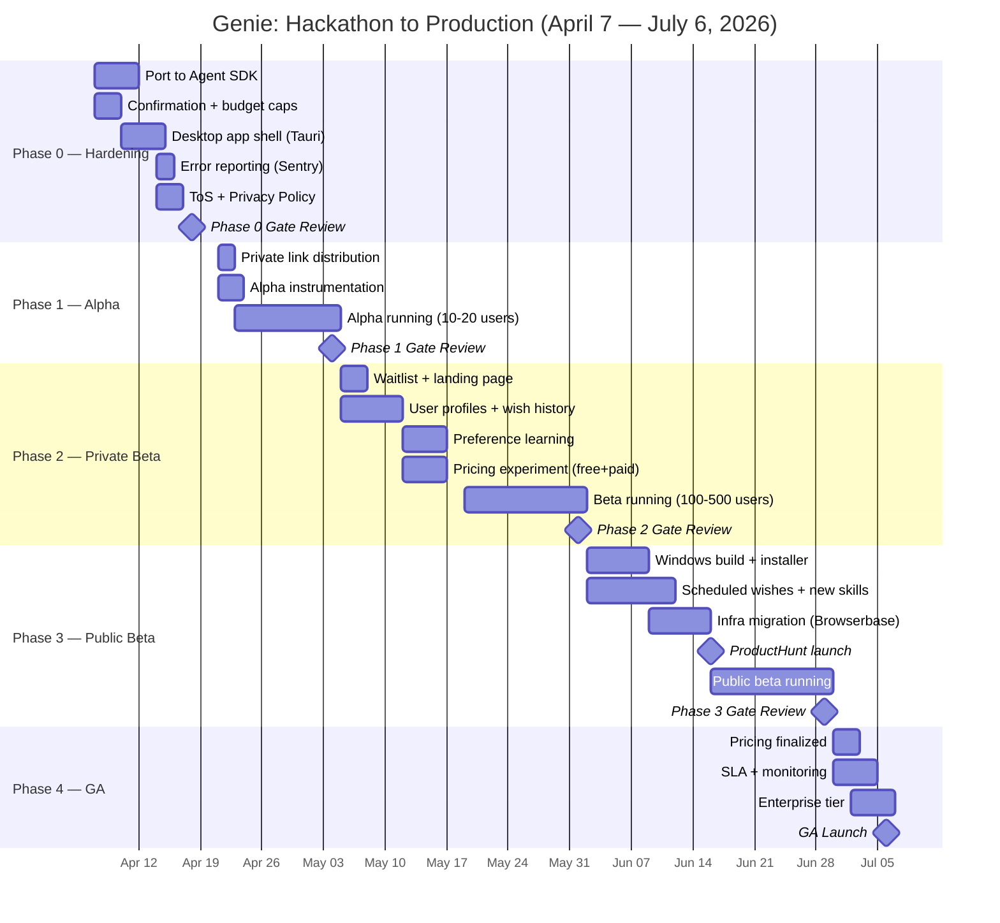

# Genie — Staged Rollout Plan

**Start date:** April 7, 2026
**GA target:** July 6, 2026 (13 weeks)
**Author:** George Trushevskiy
**Status:** Draft v1

---

## Gantt Timeline

---

## Phase 0: Hardening (Weeks 1-2 / April 7-18)

### Objective
Make the prototype safe enough that a non-George human can use it without destroying their Uber Eats budget or posting from their X account unintentionally.

### Features Shipped

**P0-1: Port from `claude -p` to Anthropic Agent SDK**
The current dispatcher shells out to `claude -p` as a subprocess. This works but gives us no programmatic control over tool calls, no streaming event hooks, no ability to inject confirmation gates. Port `dispatcher.mjs` to use the Agent SDK directly. Keep the same MCP/Playwright plumbing; replace the spawn with SDK calls.

**P0-2: Confirmation step for purchases**
Any tool call involving money (Uber Eats checkout, Stripe payment link creation, Venmo send) pauses and sends a Telegram inline-keyboard message: "Approve $X.XX for [description]? [Yes] [No]". 30-minute timeout defaults to No. Threshold: $0 for alpha (confirm everything), raised to $25 in beta.

**P0-3: Budget cap enforcement**
Per-user daily spend cap stored in `~/.genie/users/{username}.json`. Default $50/day. Cumulative tracking across wishes. Hard stop at cap — Genie reports "Budget reached for today" via Telegram.

**P0-4: Desktop app shell (Tauri)**
Wrap the server + dashboard in a Tauri app. Menu bar icon shows status (polling / executing / idle). System tray notification on wish completion. "Preferences" window for budget cap, enabled skills, linked accounts. No Electron — Tauri keeps the binary under 15MB.

**P0-5: Error reporting**
Sentry integration in `dispatcher.mjs` and all skill executors. Capture: failed tool calls, browser automation crashes, API timeouts. Tag with wish ID and user.

**P0-6: Legal**
Terms of Service covering: Genie acts on your behalf using your logged-in accounts, you are responsible for actions taken, spend limits are advisory not guaranteed. Privacy Policy: all data stays local, transcripts processed transiently, no PII sent to third parties except the services you're already logged into. Have a lawyer review — budget $500.

### Must-Fix Before Alpha
- [ ] Rate limit JellyJelly polling to avoid getting banned (currently 3s, move to 5s)
- [ ] Sanitize tweet content (no accidental slurs, no @-mentioning random people)
- [ ] Add kill switch: Telegram command `/stop` halts all active wishes immediately
- [ ] Fix Vercel deploy returning preview URL instead of production (bug #2 in CLAUDE.md — verify fix holds)
- [ ] Handle Chrome crash recovery (reconnect CDP, re-launch if needed)
- [ ] Add wish deduplication (same transcript processed twice = skip second)

### Metrics
- Build success rate (target: >95% of wishes parse and begin execution)
- Error rate by skill category
- P95 wish completion time

### Team
- George: 1 FTE engineer (all coding)
- Legal: contract lawyer for ToS ($500 one-time)

### Infrastructure
- Same as hackathon: local Mac, Chrome CDP, Vercel free tier, Telegram bot
- Add: Sentry free tier, GitHub Actions for CI

### Budget
- Engineering: $0 (George's time)
- Legal: $500
- Infra: $0 (free tiers)
- **Total: $500**

### Go/No-Go for Phase 1
- **Go:** Agent SDK port complete, confirmation flow works end-to-end, budget caps enforced, Tauri app launches and polls, Sentry catching errors, ToS drafted
- **No-Go action:** Extend by 1 week. Do not ship alpha without purchase confirmations.

---

## Phase 1: Friends & Family Alpha (Weeks 3-4 / April 21 — May 4)

### Objective
Validate that Genie works for someone who is not George, on a machine George did not set up.

### User Target
10-20 users. Hand-picked from: Betaworks community (hackathon judges/mentors who saw the demo), JellyJelly power users (Iqram's circle), George's NYC AI network.

### Distribution
Private download link (GitHub Release, private repo). DMed individually with setup instructions and a 2-minute Loom walkthrough. Users must have: Mac (Intel or Apple Silicon), JellyJelly account, Telegram.

### Features Shipped
- Tauri desktop app (Mac only)
- Onboarding flow: app opens, guides through Chrome login, Telegram connection, first test wish
- Wish success/failure reported to George's Sentry + a private Telegram group

### Metrics Tracked

| Metric | Target | Kill Threshold |
|--------|--------|----------------|
| Wish success rate | >70% | <60% |
| Avg cost per wish | <$2 | >$5 |
| Time to first wish | <10 min from install | >30 min |
| Wishes per user per week | >3 | <1 |

### Feedback Collection
After each wish, Telegram bot asks: "How'd that go? [Nailed it] [Close but off] [Wrong]"
Weekly 15-min call with 3-5 most active users.
Track: what they wished for, what broke, what they wanted to wish for but didn't.

### Kill Criteria
- Success rate below 60% after 50 wishes: **stop and fix.** Do not proceed to beta.
- Cost per wish above $5 average: **pause, optimize prompts and tool usage.**
- Fewer than 5 of 20 users complete onboarding: **redesign onboarding, extend alpha 2 weeks.**

### Support Model
George on a private Telegram group. Manual issue triage. Response time: <2 hours during waking hours.

### Team
- George: engineering + support (1 FTE)

### Budget
- Engineering: $0
- Infra: ~$50 (Vercel pro if needed, Sentry free tier)
- User incentives: $0 (alpha users are intrinsically motivated)
- **Total: ~$50**

### Go/No-Go for Phase 2
- **Go:** 60%+ success rate, 10+ users completed onboarding, cost trending under $3/wish, no data loss or account compromise incidents
- **No-Go action:** Fix top 3 failure modes, extend alpha 2 weeks, re-evaluate

---

## Phase 2: Private Beta (Weeks 5-8 / May 5 — June 1)

### Objective
Test retention and willingness to pay. Does anyone come back after the novelty wears off?

### User Target
100-500 users via waitlist. Waitlist on a landing page (deployed by Genie, naturally). Drip invites: 50/week for 4 weeks.

### Features Shipped

**User profiles:** Persistent identity tied to JellyJelly username. Preferences (default budget, preferred tone for tweets, LinkedIn headline style). Stored locally in `~/.genie/users/`.

**Preference learning:** After 5+ wishes, Genie references past wishes. "Last time you asked for a landing page, you preferred dark theme with glass panels — using that again."

**Wish history dashboard:** Tab in Tauri app showing: all wishes, status, cost, links to outputs. Filterable by category (build, outreach, order, social).

**Pricing experiment:**
- Free tier: 5 wishes/month, $10 budget cap
- Pro tier: $15/month for 50 wishes, $100 budget cap
- Implement via local license key check (no server-side auth yet)

### Metrics Tracked

| Metric | Target | Kill Threshold |
|--------|--------|----------------|
| 7-day retention | >30% | <20% |
| Wish diversity (categories used) | 3+ per active user | Only 1 category |
| NPS | >40 | <20 |
| Free-to-paid conversion | >5% | <2% |
| Cost per wish trend | Declining week-over-week | Flat or rising |

### Kill Criteria
- 7-day retention below 20%: product is a toy, not a tool. **Pivot to specific vertical** (e.g., "Genie for LinkedIn outreach only") rather than general agent.
- Cost per wish not declining: **pause new features, spend 2 weeks on prompt optimization and caching.**
- Zero paid conversions after 200 free users: **pricing is wrong or value isn't clear. Run user interviews, adjust.**

### Support Model
- FAQ document (in-app)
- Telegram support group (George + 1 community moderator from alpha)
- Bug reports via in-app button (sends to Sentry + Telegram)

### Team
- George: engineering (1 FTE)
- Community moderator: volunteer from alpha users (swag + free Pro tier)

### Infrastructure
- Tauri app with auto-update (Tauri updater plugin)
- Sentry paid tier if volume demands ($29/mo)
- Analytics: PostHog free tier (wish events, funnel tracking)

### Budget
- Engineering: $0
- Infra: ~$100/mo (Sentry + PostHog + Vercel)
- Marketing: $200 (landing page ads, minor social spend)
- **Total: ~$500**

### Go/No-Go for Phase 3
- **Go:** 30%+ 7-day retention, NPS >30, at least 10 paid users, cost/wish under $2
- **No-Go action:** If retention fails, narrow to best-performing vertical and relaunch. If cost fails, optimize before scaling.

---

## Phase 3: Public Beta (Weeks 9-12 / June 2-29)

### Objective
Scale to thousands. Prove viral potential. Validate unit economics.

### User Target
1,000-5,000 users. Open signup.

### Features Shipped

**Multi-platform:** Windows build (Tauri cross-compiles). Linux stretch goal.

**Scheduled wishes:** "Every Monday at 9am, post my weekly AI newsletter thread on X." Cron-style scheduling stored locally, executed by the server loop.

**New skills:** OpenTable reservations, Airbnb search, Notion page creation, GitHub repo setup, Google Calendar event creation.

**Cloud browser option:** For users who don't want local Chrome, offer Browserbase as a managed browser backend. Toggle in preferences. Requires Browserbase API key ($0.01/min).

### Infrastructure Migration
- Local-first stays default (the magic is watching your browser move)
- Cloud option via Browserbase for headless execution
- Modal.com for heavy compute wishes (site generation, research)
- Move from Vercel free tier to Pro ($20/mo) for team deploys

### ProductHunt Launch Sequence

**T-14 days (June 2):** Teaser post on X — 30-second screen recording of Genie ordering Uber Eats from a voice clip. No explanation, just "Coming soon."

**T-7 days (June 9):** Demo video drops. 2 minutes. Show the range:
1. Voice clip: "Genie, build me a portfolio site" — watch Chrome deploy it in 12 seconds
2. Voice clip: "Genie, order me a coffee and a croissant" — watch Uber Eats flow ($8.42 real order)
3. Voice clip: "Genie, post about my new project on X and LinkedIn" — watch both happen simultaneously
4. End card: "Your computer. Possessed. You asked for it." + waitlist link

**T-3 days (June 13):** Seed ProductHunt with 50 upvotes from alpha/beta community. DM 20 tech journalists with personalized pitches (use Genie to send them, screenshot the meta moment).

**Launch day (June 16):** ProductHunt goes live at 12:01 AM PT. George posts on X, LinkedIn, JellyJelly. Betaworks amplifies. Target: top 5 Product of the Day.

**T+1 day:** Press followup. Pitch to The Verge, TechCrunch, Hacker News. Angle: "The first agent that takes over your actual browser — and you watch it happen."

### Demo Video Strategy
Lead with the visceral moment: Chrome moving by itself. Not a dashboard. Not a chat interface. A real browser navigating real sites. The wishes to showcase:
1. **Uber Eats order** — proves real money, real delivery, real confirmation
2. **Site deploy + social post combo** — proves multi-step orchestration
3. **LinkedIn outreach** — proves professional utility, not just party tricks
4. **Scheduled wish firing** — proves it's a system, not a one-shot

### Metrics Tracked

| Metric | Target | Kill Threshold |
|--------|--------|----------------|
| Viral coefficient (K) | >0.3 | <0.1 |
| CAC (paid channels) | <$10 | >$30 |
| LTV projection (3-mo) | >$30 | <$15 |
| Daily active users | >500 | <100 after launch week |
| Wish volume | >2,000/week | <500/week |

### Partnership Angles
- **JellyJelly:** Genie is the killer app for JellyJelly adoption. Propose co-marketing: "JellyJelly + Genie = voice-controlled computer." Iqram already described "agentic social media" publicly.
- **Betaworks:** Accelerator amplification. Demo at a Betaworks event. Potential investment conversation.
- **Browserbase:** Technology partner for cloud browser. Co-case-study.

### Competitive Timing
OpenAI's "Computer Use" agent is research-preview, not consumer-facing. Anthropic's computer use is API-only. Google's Project Mariner is waitlisted. **Window: 3-6 months before any Big Lab ships a consumer desktop agent.** Move fast. The moat is not the technology — it's the skill library, the user habits, and the brand ("I'll just Genie it").

### Team
- George: engineering lead (1 FTE)
- Contract engineer #2: $5K/mo, focused on Windows port + new skills
- Community moderator: upgraded to part-time ($1K/mo)

### Budget
- Engineering: $5K/mo (contractor)
- Infra: $500/mo (Vercel Pro, Sentry, PostHog, Browserbase credits)
- Marketing: $2K (ProductHunt, social ads, press outreach)
- Support: $1K/mo (community mod)
- **Total: ~$8,500/mo**

### Go/No-Go for Phase 4
- **Go:** 1,000+ WAU, viral coefficient >0.2, at least 50 paid users, unit economics viable (LTV > 3x CAC)
- **No-Go action:** If growth stalls, double down on best vertical. If economics fail, raise price or cut costs. If quality fails, freeze features and fix for 2 weeks.

---

## Phase 4: General Availability (Weeks 13-16 / June 30 — July 6+)

### Objective
Remove "beta." Commit to reliability. Start generating revenue.

### Features Shipped
- **Pricing finalized:** Free (3 wishes/mo) / Pro $19/mo (100 wishes) / Team $49/mo/seat (shared skills, team budget)
- **SLA published:** 99.5% server uptime, <5 min completion for simple wishes (site deploy, social post), <15 min for complex (multi-step outreach, orders)
- **Enterprise tier:** Custom budget limits, SSO, audit log, dedicated support. Priced per conversation.
- **Auto-update:** Tauri handles seamless background updates

### Infrastructure
- Production monitoring: Sentry + PagerDuty (George on-call)
- Uptime monitoring: BetterStack
- Database: SQLite locally, optional Supabase sync for cross-device wish history

### Team (by GA)
- George: CEO/lead engineer
- Engineer #2: full-time ($8K/mo or equity-heavy offer)
- Designer: contract ($3K for app polish, onboarding flow, marketing site)
- Support: 1 part-time ($1.5K/mo)

### Budget
- Engineering: $8K/mo
- Design: $3K (one-time)
- Infra: $800/mo
- Support: $1.5K/mo
- Legal (ongoing): $200/mo (compliance review)
- **Total: ~$13,500/mo (target: covered by revenue at 700+ paid users)**

---

## Hiring Plan

| When | Role | Type | Why |
|------|------|------|-----|
| Week 7 (mid-May) | Engineer #2 | Contract, $5K/mo | Windows port, new skills, keep pace while George handles product |
| Week 10 (mid-June) | Community mod | Part-time, $1K/mo | Support load from public beta |
| Week 12 (late June) | Designer | Contract, $3K one-time | App polish, marketing site, onboarding |
| Week 14 (early July) | Engineer #2 upgrade | Full-time, equity-heavy | If GA metrics warrant |
| Week 16+ | Support person | Part-time, $1.5K/mo | If >1,000 paid users |

**Hiring signal:** If wish volume exceeds 5,000/week and George is spending >50% of time on support instead of engineering, hire immediately. Don't wait for the planned week.

---

## What Happens If We Miss Gates

| Phase | Miss Scenario | Action |
|-------|--------------|--------|
| P0 | Agent SDK port takes >2 weeks | Ship alpha with `claude -p` shelling. Port in background. Don't block on architecture purity. |
| P1 | Success rate <60% | Categorize failures. If browser automation is the bottleneck, ship without browser skills (deploy-only Genie). If interpretation fails, swap to GPT-4o for parsing. Fix for 2 weeks, re-alpha. |
| P1 | <5 users complete onboarding | Onboarding is broken, not the product. Fly to Betaworks, sit with 3 users, watch them install. Fix in real-time. |
| P2 | 7-day retention <20% | General agent is too broad. Narrow to the vertical with highest retention (probably LinkedIn outreach or Uber Eats). Relaunch as "Genie for [X]". |
| P2 | Zero paid conversions | Value is unclear or price is wrong. Try $9/mo. Try usage-based ($0.25/wish). If still nothing, the product is entertaining but not useful — pivot to B2B (Genie as internal ops agent). |
| P3 | ProductHunt flops (<100 upvotes) | Distribution problem, not product problem. Go grassroots: post daily demo videos on X, TikTok, YouTube Shorts. One viral clip can replace ProductHunt entirely. |
| P3 | Viral coefficient near zero | People use it but don't share it. Add "Built by Genie" watermark to deployed sites. Add "Wished into existence" share button after each wish. Make the output inherently shareable. |

---

## Risk Register

| Risk | Likelihood | Impact | Mitigation |
|------|-----------|--------|------------|
| JellyJelly API changes or shuts down | Medium | Critical | Add alternative input: local microphone, Telegram voice message, text input as fallback |
| Chrome automation detected/blocked by LinkedIn, X, Gmail | High | High | Rate limit actions (max 10 LinkedIn requests/day). Rotate timing. Use official APIs where available (X API, Gmail API). Browser automation is the demo; API is the production path. |
| OpenAI/Google ships consumer desktop agent | Medium | High | Ship fast. Build skill library moat. Community moat. "Genie was first" narrative. |
| User causes harm via Genie (spam, harassment) | Medium | Critical | Confirmation gates, rate limits, content filtering on outgoing messages, ToS enforcement |
| Cost per wish doesn't decrease | Medium | Medium | Prompt caching, smaller models for simple wishes, skill-specific routing (don't use Opus for a tweet) |

---

## Key Dates Summary

| Date | Event |
|------|-------|
| April 7 | Phase 0 starts — hardening sprint |
| April 18 | Phase 0 gate — alpha-ready |
| April 21 | Alpha launch — 10-20 users |
| May 4 | Alpha gate review |
| May 5 | Private beta — waitlist opens |
| May 19 | First paid users |
| June 1 | Beta gate review |
| June 2 | Public beta + Windows build |
| June 9 | Demo video drops |
| June 16 | ProductHunt launch day |
| June 29 | Public beta gate review |
| July 6 | General Availability |

---

## The One Metric That Matters (per phase)

- **Phase 0:** Does the confirmation flow stop a bad purchase? (binary)
- **Phase 1:** Wish success rate (>60%)
- **Phase 2:** 7-day retention (>30%)
- **Phase 3:** Viral coefficient (>0.3)
- **Phase 4:** Monthly recurring revenue ($10K target = ~525 paid users at $19/mo)

---

*Total investment over 13 weeks: ~$25,000 (mostly contractor + infra in phases 3-4). Revenue target at GA: $10K MRR. If alpha proves product-market fit, raise a small round ($250K-$500K) at Phase 2 to accelerate hiring and marketing.*
