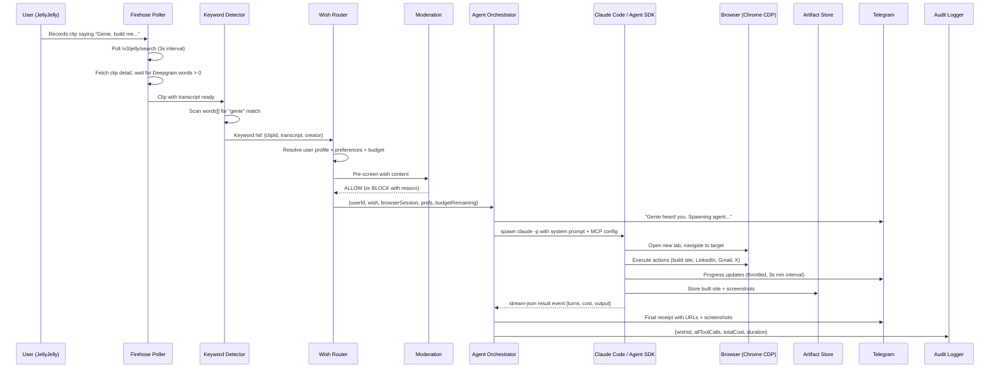
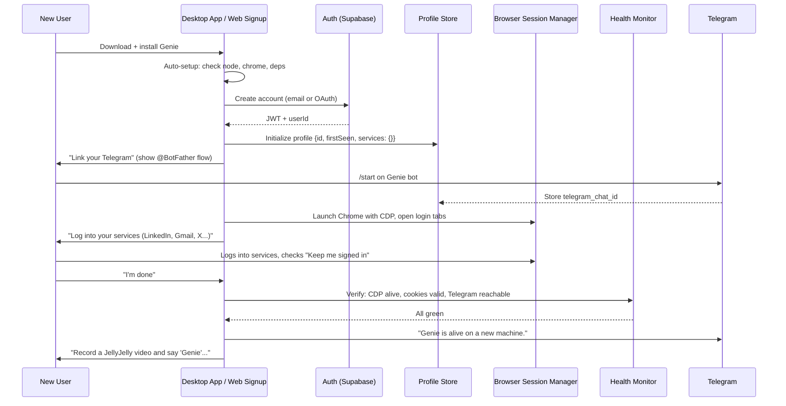
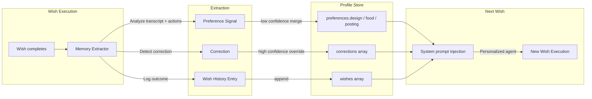
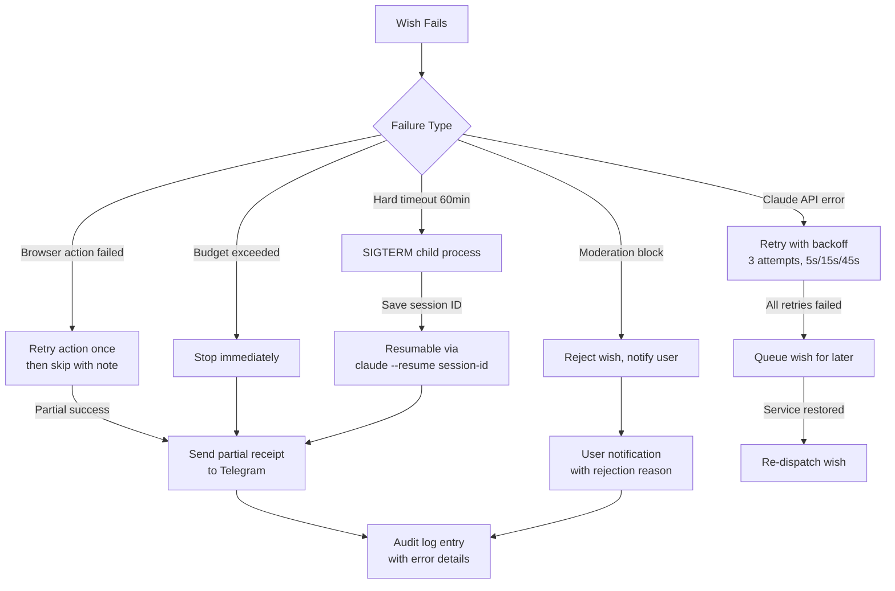
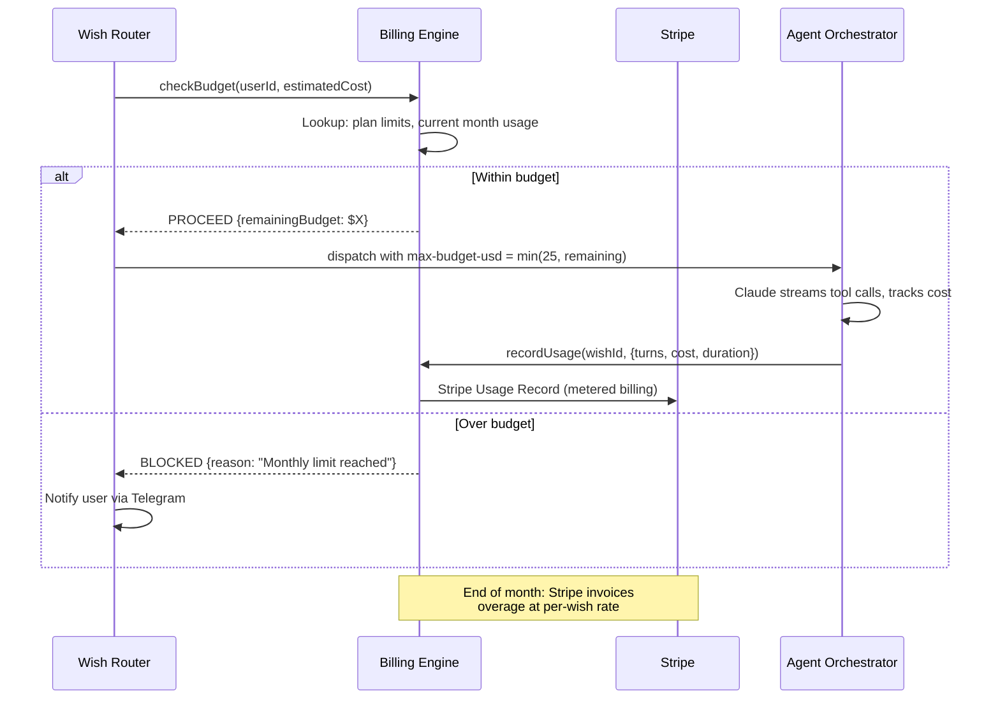

# 07 — Genie Production System Architecture

The technical bible. Every component, every connection, every data flow.

---

## 1. Component Inventory

| # | Component | What It Does | Talks To | Technology | Owner |
|---|-----------|-------------|----------|------------|-------|
| 1 | **JellyJelly Firehose Poller** | Polls `/v3/jelly/search` every 3s, tracks cursor, fetches clip detail, waits for Deepgram transcript | Keyword Detector, JellyJelly API | Node.js ESM (`firehose.mjs`) | Core |
| 2 | **Keyword Detector + Transcript Processor** | Scans word-level transcript for "genie", reconstructs full text, handles 0-word Deepgram race condition | Firehose Poller, Wish Router | Node.js (`server.mjs` + `firehose.mjs`) | Core |
| 3 | **Wish Router** | Maps clip creator to user profile, resolves browser session, preferences, budget limits, queues if at capacity (max 5 concurrent) | Keyword Detector, User Profile Store, Agent Orchestrator | Node.js (`server.mjs` dispatch logic) | Core |
| 4 | **Agent Orchestrator** | Spawns Claude Code / Agent SDK instance per wish. Streams `stream-json` events, throttles Telegram updates, enforces 60-min hard timeout | Wish Router, Browser Session Manager, Notification Router, Audit Logger | `dispatcher.mjs` spawning `claude -p` (v1) / Agent SDK `query()` (v2) | Core |
| 5 | **Browser Session Manager** | Manages persistent Chrome via CDP `:9222`. Local: launchd `com.genie.chrome` with `--remote-debugging-port`. Cloud: Browserbase Contexts keyed by userId | Agent Orchestrator, Playwright MCP | Playwright MCP (`@playwright/mcp`) + Chrome CDP | Core |
| 6 | **User Profile Store** | Stores identity, connected services, preferences, corrections, wish history per user | Wish Router, Agent Orchestrator, Memory Extractor | Local: JSON at `~/.genie/users/` (`memory.mjs`). Prod: Supabase/Postgres | Memory |
| 7 | **Credential Vault** | Stores OAuth tokens, API keys, browser cookies per user. Currently implicit (Chrome profile cookies) | Browser Session Manager, Agent Orchestrator | Local: Chrome profile at `~/.genie/browser-profile/`. Prod: encrypted Postgres column + Doppler/Vault | Security |
| 8 | **Notification Router** | Sends progress updates, receipts, screenshots, errors to user's preferred channel | Agent Orchestrator, User Profile Store | `telegram.mjs` (Telegram Bot API). Prod adds: push notifications, email via Resend | Core |
| 9 | **Billing Engine** | Tracks per-wish Claude API cost (`total_cost_usd`), turn count, enforces `max-budget-usd` per wish and monthly caps per user | Agent Orchestrator, Stripe | In-process metering (v1). Stripe Meters + Usage Records (v2) | Billing |
| 10 | **Wish Artifact Store** | Stores built sites, screenshots, generated files with wish-level provenance | Agent Orchestrator, User Dashboard | Local: `/tmp/genie/{slug}/`. Prod: Cloudflare R2 with signed URLs | Core |
| 11 | **Audit Logger** | Logs every tool call, browser action, Telegram message with wish/user/timestamp context | Agent Orchestrator (stream-json events) | Local: stdout + `/tmp/genie-logs/`. Prod: Axiom or ClickHouse | Ops |
| 12 | **Health Monitor** | Checks CDP connectivity, JellyJelly API reachability, cookie validity, Telegram bot health | All components, Admin Dashboard | Startup health check in `CLAUDE.md`. Prod: dedicated healthcheck loop | Ops |
| 13 | **Admin Dashboard** | Ops view: active wishes, costs, errors, kill buttons, user list | All backend components via Redis pub/sub | Placeholder (`dashboard/server.mjs`). Prod: React + SSE | Ops |
| 14 | **User Dashboard** | Wish history, settings, connected services, preference editor | User Profile Store, Wish Artifact Store | Web app inside Electron renderer or hosted SPA | Product |
| 15 | **Desktop App Shell** | Wraps entire system (server + browser + UI) in installable app | All local components | Electron (Chromium doubles as agent browser + app UI) | Platform |
| 16 | **Auto-Updater** | Ships app updates, skill updates, prompt updates without user intervention | GitHub Releases, Desktop App Shell | `electron-updater` with blockmap diffs (~2-5MB patches) | Platform |
| 17 | **Moderation Layer** | Haiku classifier pre-screens wish content, domain allowlist blocks dangerous sites, budget caps prevent runaway | Wish Router, Agent Orchestrator | Claude Haiku API call + static allowlist config | Safety |
| 18 | **Kill Switch** | Global (disable all wishes) + per-user (disable one user) + per-wish (abort subprocess) emergency stop | Admin Dashboard, Agent Orchestrator | `SIGTERM` to child process (local). Redis flag + process group kill (cloud) | Safety |

---

## 2. Data Flow Diagrams

### 2.1 Happy Path: Wish Fulfilled



### 2.2 Onboarding Flow



### 2.3 Memory Flow



### 2.4 Error / Recovery Flow



### 2.5 Billing Flow



---

## 3. API Contracts

### Firehose --> Wish Router

```typescript
interface ClipDetection {
  clipId: string;           // JellyJelly ULID
  creator: string;          // JellyJelly username
  transcript: string;       // Reconstructed plaintext from word-level data
  clipTitle: string;        // Clip title or description
  keyword: string;          // Matched keyword ("genie")
  wordCount: number;        // Transcript word count (guards against 0-word race)
  timestamp: string;        // ISO 8601 clip posted_at
}
```

### Wish Router --> Agent Orchestrator

```typescript
interface WishDispatch {
  userId: string;           // Internal user ID
  clipId: string;
  transcript: string;
  clipTitle: string;
  creator: string;
  keyword: string;
  preferences: UserPreferences;    // From profile store
  corrections: Correction[];       // High-priority overrides
  browserSessionUrl: string;       // "http://127.0.0.1:9222" or Browserbase wss:// URL
  budgetUsd: number;               // Per-wish cap (min of $25 default, remaining monthly)
  maxTurns: number;                // Default 200
  connectedServices: string[];     // ["x", "linkedin", "gmail", "vercel"]
}
```

### Agent Orchestrator --> Claude Code / Agent SDK

```typescript
// v1: CLI spawn
const args = [
  '-p',
  '--model', model,
  '--append-system-prompt', systemPromptText,
  '--mcp-config', mcpConfigPath,
  '--permission-mode', 'bypassPermissions',
  '--max-turns', '200',
  '--max-budget-usd', '25',
  '--output-format', 'stream-json',
];
// User prompt piped to stdin

// v2: Agent SDK (direct library call)
import { query } from '@anthropic-ai/claude-agent-sdk';
const stream = query({
  prompt: userPrompt,
  systemPrompt: systemPromptText,
  model: 'sonnet',
  mcpServers: { playwright: { ... } },
  permissionMode: 'bypassPermissions',
  maxTurns: 200,
  maxBudgetUsd: 25,
});
```

### Agent --> Notification Router

```typescript
interface NotificationEvent {
  userId: string;
  wishId: string;
  type: 'progress' | 'result' | 'error' | 'screenshot';
  channel: 'telegram' | 'push' | 'email';
  payload: {
    text?: string;
    photoPath?: string;       // For screenshots
    urls?: string[];          // Deployed site URLs
    cost?: number;
    turns?: number;
    duration?: number;
  };
}
```

### Agent --> Artifact Store

```typescript
interface ArtifactUpload {
  wishId: string;
  userId: string;
  files: Array<{
    path: string;             // Relative path within wish dir
    content: Buffer | string;
    mimeType: string;
  }>;
  deployedUrls: string[];     // Vercel URLs, etc.
  screenshots: string[];      // Paths to screenshot PNGs
  createdAt: string;
}
```

### Agent --> Audit Log

```typescript
interface AuditEntry {
  wishId: string;
  userId: string;
  sessionId: string;          // Claude Code session ID
  toolName: string;           // "Bash", "mcp__playwright__browser_navigate", etc.
  toolInput: object;          // Truncated to 1KB
  toolOutput: string;         // Truncated to 1KB
  isError: boolean;
  timestamp: string;
  costUsd: number;            // Incremental cost for this turn
}
```

---

## 4. State Management

| State | Current (v1 Local) | Production (v2+) | TTL / Lifecycle |
|-------|-------------------|-------------------|-----------------|
| User profiles | JSON files at `~/.genie/users/{username}.json` | Supabase Postgres `users` table | Permanent |
| Browser sessions | Chrome profile at `~/.genie/browser-profile/` | Browserbase Contexts (keyed by userId) | Permanent per user, cookies expire per service |
| Active wishes | In-memory counter + overflow queue in `server.mjs` | Redis sorted set `active_wishes` | Duration of wish execution (seconds to minutes) |
| Wish history | In user JSON `.wishes[]` | Postgres `wishes` table (FK to users) | Permanent |
| Artifacts | `/tmp/genie/{slug}/` on local disk | Cloudflare R2 bucket `genie-artifacts` | 90 days, then archive to cold storage |
| Audit logs | stdout + `/tmp/genie-logs/launchd.out.log` | Axiom dataset `genie-audit` | 1 year hot, 7 years cold |
| Billing events | In-memory cost tracking from stream-json `result` event | Stripe Billing Meters + Postgres `billing_events` | Permanent (financial records) |
| Real-time wish status | Console logs | Redis pub/sub channel `wish:{wishId}` --> SSE to dashboard | Ephemeral (active wish only) |
| Firehose cursor | In-memory variable in `firehose.mjs` | Redis key `firehose:cursor` | Updated every poll cycle |
| Kill switch flags | N/A (manual SIGTERM) | Redis keys `killswitch:global`, `killswitch:user:{id}` | Until manually cleared |

---

## 5. Security Architecture

### Authentication

```
Desktop app login:
  User --> Supabase Auth (email/password or OAuth)
       --> JWT issued (1hr access, 7d refresh)
       --> Stored in Electron secure storage (keychain on macOS)
       --> Attached to all API calls as Bearer token

Hosted service:
  Same Supabase Auth, JWT in httpOnly cookie
  Session refresh handled by Supabase client SDK
```

### Authorization (Genie acting on behalf of user)

```
Browser cookies: Stored in per-user Chrome profile / Browserbase Context
  - LinkedIn, Gmail, X, Vercel, GitHub sessions
  - Isolated per user (separate Chrome profiles or Browserbase contexts)
  - Cookie health checked on each wish dispatch

API keys: User provides (Stripe, OpenRouter, etc.)
  - Encrypted at rest (AES-256-GCM) in Postgres
  - Decrypted in-memory only during wish execution
  - Never logged, never included in audit entries
```

### Encryption

| Layer | Method |
|-------|--------|
| In transit | TLS 1.3 everywhere. Browserbase wss://. Supabase enforced TLS. |
| At rest (credentials) | AES-256-GCM with per-user envelope keys, master key in Doppler/Vault |
| At rest (profile data) | Postgres with disk encryption (Supabase default) |
| At rest (artifacts) | R2 server-side encryption (SSE-S3) |

### User Isolation

```
Local (single user): Full machine isolation. One Chrome profile. One server process.

Cloud (multi-user):
  - Each user gets a dedicated Browserbase Context (separate cookie jar, history, storage)
  - Each wish runs in its own Claude Code process (OS-level process isolation)
  - Agent SDK instances share no memory between users
  - Postgres RLS policies enforce user-level row access
  - R2 artifacts keyed by userId prefix: artifacts/{userId}/{wishId}/
  - Redis keys namespaced by userId
```

### Audit Trail

Every action is traceable: `userId --> wishId --> sessionId --> toolCall --> timestamp`. The stream-json output from Claude Code provides this natively. In production, these events flow to Axiom with structured fields for querying: "show me every browser action user X's wishes performed last week."

---

## 6. Failure Modes and Recovery

| Component | Failure Mode | Impact | Recovery | Alert |
|-----------|-------------|--------|----------|-------|
| **JellyJelly API** | 5xx or timeout | Wishes not detected | Retry polling with exponential backoff (5s, 15s, 60s). Resume from saved cursor. | Telegram to ops after 3 consecutive failures |
| **Browserbase / Chrome CDP** | Connection refused | Browser actions fail | Text-only wishes still work (build + deploy, no browser cascade). Queue browser actions for retry. | Health monitor flags "browser: DOWN" |
| **Claude API / Anthropic** | 529 overloaded or 5xx | No wishes execute | Queue wish, retry in 30s. After 3 failures, notify user "Genie is temporarily slow." | PagerDuty after 5min downtime |
| **Postgres / Supabase** | Connection error | No profile reads, no history writes | Use in-memory cached preferences (stale but functional). Queue writes for replay. | Immediate ops alert |
| **Stripe** | API error | Billing delayed | Continue serving wishes. Log billing events locally. Reconcile when Stripe recovers. | Daily reconciliation check |
| **Telegram Bot API** | 429 rate limit or 5xx | User doesn't see updates | Buffer messages, retry with backoff. User still gets final receipt when API recovers. | Log only (non-critical) |
| **Vercel CLI** | Deploy fails | Site not published | Retry once. If still failing, store artifact and notify user with local file path. | Per-wish error in receipt |
| **Agent subprocess crash** | Non-zero exit, OOM, or timeout | Wish partially complete | Save session ID. User can resume via `claude --resume {id}`. Auto-retry once for exit codes != budget/turn limit. | Telegram error notification |
| **Firehose cursor lost** | Process restart | May re-process clips | `seenClipIds` Set prevents duplicate dispatch. On restart, cursor set to 10 min ago (existing behavior). | None needed (idempotent) |

---

## 7. Technology Decision Matrix

### App Shell: Electron vs Tauri

| Criterion | Electron | Tauri |
|-----------|----------|-------|
| Bundle size | ~150MB (includes Chromium) | ~3MB (uses system WebView) |
| CDP support | Built-in Chromium IS the agent browser | WebView cannot do CDP; must ship separate Chromium anyway |
| Child processes | Native `child_process.spawn()` | Sidecar system, requires binary compilation |
| Auto-update | `electron-updater`, battle-tested | Built-in, good but less ecosystem |

**Winner: Electron.** Genie needs a controllable Chromium. Tauri + sidecar Chromium is just a worse Electron. Revisit if Tauri adds CDP support for system WebView.

### Agent Execution: CLI Spawn vs Agent SDK

| Criterion | `claude -p` spawn | Agent SDK `query()` |
|-----------|-------------------|---------------------|
| Setup complexity | Zero (current architecture) | Import library, remove spawn logic |
| Streaming | stdout line-buffered JSON parsing | Native async generator |
| Process isolation | Full OS process per wish | In-process (need worker threads for isolation) |
| Bundle size | Must ship `claude` binary (~50MB) | NPM dependency (~5MB) |

**Winner: CLI spawn for v1** (already works, full process isolation). **Agent SDK for v2** (cleaner, smaller bundle, better streaming). Migration path: replace `dispatcher.mjs` internals, keep same interface.

### Database: Supabase vs PlanetScale vs Neon

| Criterion | Supabase | PlanetScale | Neon |
|-----------|----------|-------------|------|
| Auth built-in | Yes (email, OAuth, magic link) | No | No |
| RLS policies | Native Postgres RLS | N/A (MySQL) | Native Postgres RLS |
| Real-time | Built-in subscriptions | No | No |
| Free tier | 500MB, 50K monthly active users | Deprecated free tier | 512MB, generous |
| Edge functions | Yes (Deno) | No | No |

**Winner: Supabase.** Auth + RLS + real-time subscriptions in one service. The auth alone saves weeks of development. Would switch to Neon if we outgrow Supabase's pricing or need branching for dev/staging.

### Artifact Storage: R2 vs S3 vs Vercel Blob

| Criterion | Cloudflare R2 | AWS S3 | Vercel Blob |
|-----------|---------------|--------|-------------|
| Egress cost | $0 | $0.09/GB | Free with Vercel plan |
| S3-compatible | Yes | Yes | No |
| Edge caching | Automatic via Cloudflare | Needs CloudFront | Automatic |
| Free tier | 10GB storage, 10M reads/mo | 5GB, 20K GETs | 1GB |

**Winner: Cloudflare R2.** Zero egress costs for serving screenshots and built sites. S3-compatible API means standard tooling works. Would switch to S3 only if we need features like S3 Object Lambda or deep AWS integration.

### Audit / Analytics: Axiom vs ClickHouse vs Postgres

| Criterion | Axiom | Self-hosted ClickHouse | Postgres (same DB) |
|-----------|-------|------------------------|---------------------|
| Ingestion speed | Millions events/sec | Millions events/sec | Bottleneck at scale |
| Query latency | Sub-second on TB scale | Sub-second on TB scale | Degrades past 10M rows |
| Ops burden | Zero (managed SaaS) | High (self-managed) | Zero (already running) |
| Cost | Free tier: 500GB ingest/mo | Hosting cost | Already paid |

**Winner: Postgres for v1** (already there, audit volume is tiny). **Axiom for v2+** (when volume exceeds what Postgres handles comfortably, ~10M rows). Would use ClickHouse only if self-hosting becomes necessary for data residency.

---

## 8. Scale Stages

### Stage 0: Single Mac (Current)

```
One Mac running:
  - launchd: com.genie.server (polls JellyJelly, dispatches)
  - launchd: com.genie.chrome (persistent Chrome, CDP :9222)
  - Claude Code CLI spawned per wish (max 5 concurrent)
  - JSON files for user memory
  - /tmp/ for artifacts
  - Telegram for output
```

### Stage 1: Desktop App (10-100 users)

```
Electron app bundles everything:
  - Server runs in Electron main process
  - Bundled Chromium serves as both app UI and agent browser
  - Agent SDK replaces CLI spawn (in-process)
  - Supabase for auth + profiles (replaces JSON files)
  - R2 for artifacts (replaces /tmp/)
  - Local SQLite for offline wish queue
```

### Stage 2: Hosted Service (100-1000 users)

```
  - Firehose Poller: single process on Fly.io (or Railway)
  - Wish Router: Express API on Fly.io
  - Agent Orchestrator: Fly Machines (one per wish, auto-scale)
  - Browser: Browserbase Contexts (one per user)
  - Database: Supabase (Postgres + Auth + RLS)
  - Artifacts: Cloudflare R2
  - Billing: Stripe Meters
  - Queue: Redis (Upstash) for wish queue + pub/sub
  - Audit: Axiom
```

### Stage 3: Platform (1000+ users)

```
  Everything in Stage 2, plus:
  - Multi-region Fly deployment (US-East, EU-West)
  - Firehose sharding by username hash
  - Agent pool with warm-start (pre-initialized SDK instances)
  - CDN for artifact delivery (Cloudflare)
  - Dedicated Browserbase account with reserved capacity
  - SOC 2 compliance (Axiom audit trail, encrypted credentials)
```

---

## 9. Cross-Cutting Concerns

### How Other Workstreams Connect

| Workstream | Touches Components | Integration Point |
|------------|-------------------|-------------------|
| Desktop App (01) | App Shell, Auto-Updater, Browser Session Manager | Electron main process hosts server + browser |
| User Memory (02) | User Profile Store, Agent Orchestrator | Preferences injected into system prompt per wish |
| Edge Cases / Safety (03) | Moderation Layer, Kill Switch, Audit Logger | Pre-dispatch screening + runtime abort |
| Cloud Deployment (04) | All server-side components | Fly Machines + Browserbase + Supabase + R2 |
| Rollout Plan (05) | All components (feature flags gate new ones) | LaunchDarkly or Supabase Edge Config for flags |
| User Onboarding (06) | Auth, Profile Store, Browser Session Manager, Health Monitor | Setup wizard in Electron or hosted web flow |

### Observability Stack

```
Logs:    stdout (local) --> Axiom (prod)
Metrics: process.memoryUsage() + custom counters --> Axiom
Traces:  wish lifecycle spans --> Axiom (OpenTelemetry format)
Alerts:  Axiom monitors --> PagerDuty (critical) / Telegram (info)
```

### Configuration Hierarchy

```
Defaults (hardcoded in code)
  < .env file (local overrides)
    < Environment variables (cloud deploy)
      < Supabase remote config (feature flags, per-user limits)
        < User preferences (from profile store)
          < User corrections (highest priority)
```
